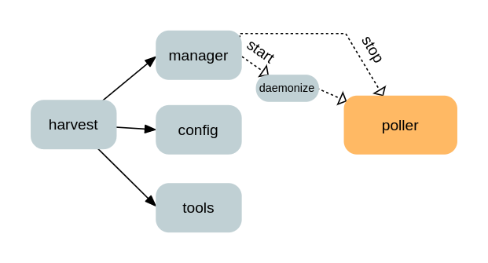
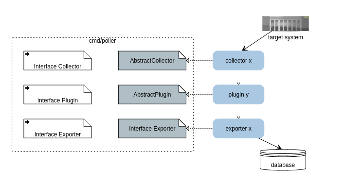

# Architecture

This document describes the high-level architecture of Harvest. If you want to familiarize yourself with the code base, you're in the right place!

Harvest has a relatively small, but fairly dense code base. We try to maintain a strongly modular design, this means that if you develop a collector, you don't need to understand what the poller does.

## Bird's Eye View

Harvest consists of several processes/packages. All, except Poller, are short-lived processes. Here is an overview of the important ones:

* **harvest**: the main executable and entry-point for the user, it's task is mainly to trigger the other processes
* **manager**: starts, stops and shows the status of pollers
* **poller**: daemon process that polls a target system
* **config**: helps to validate and configure harvest
* **tools**: auxiliary utilities, normally not part of the workflow of harvest itself

### Poller

The Poller is a daemon process that will poll metrics from one target system and emit to one or many databases. It is, however, agnostic about the target system, the API used to retrieve data and export to the databases. The actual work is done by collectors, plugins and exporters. All of these (except built-in plugins) are not part of the main program, they are compiled separately as `.so` binaries and loaded dynamically at runtime.

The package poller provides three interfaces:
* [Collector](cmd/poller/collector/collector.go)
* [Plugin](cmd/poller/plugin/plugin.go)
* [Exporter](cmd/poller/exporter/exporter.go)

It also provides three "abstract" types:
* [AbstractCollector](cmd/poller/collector/collector.go)
* [AbstractPlugin](cmd/poller/plugin/plugin.go)
* [AbstractExporter](cmd/poller/exporter/exporter.go)

These types implement most of the methods of their respective interfaces. A collector, plugin or exporter will usually "inherit" (or override) these methods, meaning that adding a new component requires implementing only few methods.

### Configuration

One of the tasks of the Poller is to parse CLI flags and configuration files and pass them over to collectors and exporters:
* Poller Options (type *[poller.Options](cmd/poller/options/options.go))
* Params (type *[node.Node](pkg/tree/node/node.go))

 

For exporters, *Params*, is the exact parameters of the exporter as defined in `harvest.yml`. For collectors, *Params*, is a top-down merge of:
* poller parameters from `harvest.yml` (can include `addr`, `auth_style`, etc.)
* collector default template (can include poll frequency, list of counters, etc)
* collector custom template (same)

Since the Poller is agnostic about the system collectors will poll, it is the user's (and developer's) responsibility to make sure required parameters are available in their right place.

### Collectors

Collectors are responsible for collecting metrics from a data source and writing them into a Matrix instance.

Collectors are "object-oriented", which means that metrics are grouped together by the logical unit that they describe (such as volume, node, process, file). If there are more than one objects defined for a collector, then for each object a new instance of the collector will be created (example of such "multi-object" collectors are [Zapi](cmd/collectors/zapi/) and [ZapiPerf](cmd/collectors/zapiperf/). This means that the user only needs to add a new template file if they want to collector a new object.

Most of the auxiliary jobs that a collector needs to do (such as initializing, running on scheduled time, reporting status to Poller, updating metadata and handling errors) are implemented by the AbstractCollector. Writing a new collector, most of the times, only requires implementing the `PollData()` method.

Creating a new collector is easy: run `harvest new collector` to get quickly started.

### Plug-Ins

Plug-ins are optional and run as part of the collector. They will customize, post-process metrics from collectors, aggregate new metrics or trigger user-defined actions. They allow you to extend Harvest without writing a new collector. Some plugins will collect additional metrics on their own (example: [Zapi/SnapMirror](cmd/collectors/zapi/plugins/snapmirror/snapmirror.go)).

Harvest includes a range of built-in, collector-independent plugins for generic customization (see [documentation](cmd/poller/plugin/README.md)). Run `harvest new plugin` to write your own plugin.

### Exporters 

Exporters write metrics to an external data source (usually time-series database). They will read the metrics from a Matrix instance passed to them by collectors, encode them to the required format and send to the database.

The way "sending" is done, can be quite different. For example, the [InfluxDB exporter](cmd/exporters/influxdb/README.md) will simply push (HTTP PUT request) to the InfluxDB, while the [Prometheus exporter](cmd/exporters/prometheus/README.md) will expose the metrics on an HTTP server and wait for Prometheus scrapers to collect them.

If you are courageous, run `harvest new exporter` to write your own exporter. 

## Data Structures

### Matrix

The Matrix provides storage for numerical and label data. It is the backbone of Harvest's architecture. Components of Harvest can work independently, yet interact with each other, only because they all know how to read or write into a Matrix instance.

The Matrix also imposes some constraint. For example, metrics should be typed, histograms should be converted into "flat" metrics, instance and metric names should be unique. For details see [documentation](pkg/matrix/README.md).

This package is in a semi-frozen, stable state and will not change (much) in the future.

### Tree

The Tree data structure ([*node.Node](pkg/tree/node/node.go)) is used for unstructured and untyped data. It provides read/write methods that are independent of the underlaying data format (`xml`, `yaml`, `json`). It is mainly used for API calls and for storing configuration files. 

Often collectors will receive an XML from their target system, parse it into a Tree, then extract meaningful information and write it into the Matrix.

Unlike, the Matrix, this package is not in a stable state and will likely need a rewrite.

## Code Map

This section describes the directories of the project and how source files are organized:

### `/` 
The root directories contains scripts for building Harvest:
* `MakeFile` - script for building and installing Harvest
* `package` - script for building distribution packages (uses the subdirectories `deb/` and `rpm/`)
* `harvest.yml` - main configuration file

### `conf/`
Contains configuration files of collectors organized in subdirectories. The exact contents of each subdirectory depends on the design of the collector, but each collector should at least have a `default.yaml` (and optionally `custom.yaml`) file.

### `cmd/`
This directory contains all packages that are either compiled as executables or shared objects (`.so` files)
* `collectors/` - each subdirectory contains a collector that is compiled as a `.so` shared object, if you create a new collector, you should add a new subdirectory here
* `exporters/` - same as above, each subdirectory contains an exporter
* `harvest/` - contains the package and subpackages that are compiled as the main executable `harvest`
  * `config/` - the config utility
  * `manager/` - the manager utility for starting and managing pollers
  * `new/` - development utility for creating a new collector, exporter or plugin
  * `version/` - harvest version and build info
* `poller/` - contains the poller program and subpackages:
  * `collector/` - provides interface Collector and type AbstractCollector
  * `exporter/` - provides interface Exporter and type AbstractExporter
  * `plugin/` - provides interface Plugin, type AbstractPlugin and built-in plugins in subdirectories
  * `options/` - provides type Options (poller start-up options)
  * `schedule/` - provides type Schedule
* `tools/` - each subdirectory is a tool, compiled as an executable
  
### `pkg/`
This directory contains all packages that are imported and used as shared libraries. List below contains only important ones:
* `api/` - each subdirectory is a package for communication with a (remote) system using some protocol
* `argparse/` - package for parsing CLI arguments and flags (might be replaced by an external lib)
* `config/` - package for importing harvest configuration file
* `dialog/` - methods for interacting with user using `dialog` or `whiptail` (needs to be installed on local system)
* `dload/` - methods for dynamically loading shared objects (uses the standard [plugin](https://golang.org/pkg/plugin/) library)
* `errors/` - harvest errors
* `logger/` - wrapper methods around the standard [log](https://golang.org/pkg/log/) package
* `matrix/` - the Matrix data structure
* `tree/` - the Tree data structure
* `util/` - helper functions

## Request Flows

## Life-cycle
