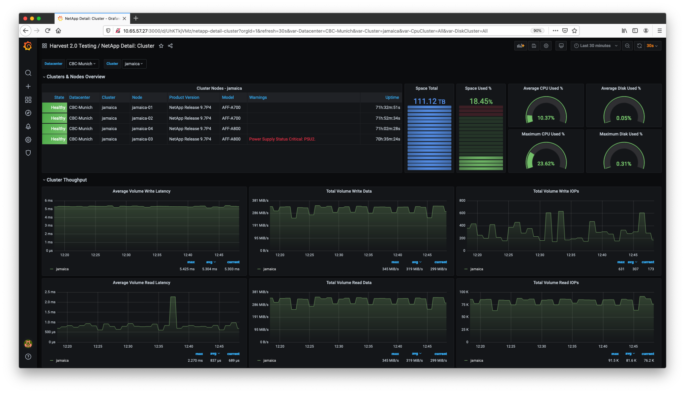
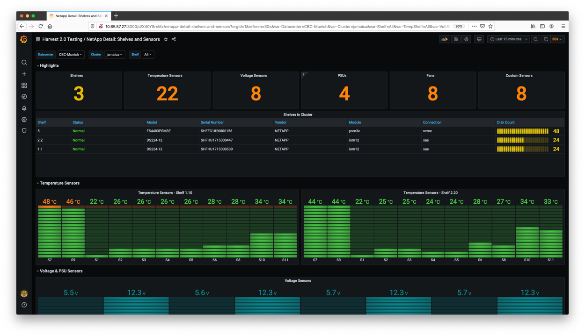

# NetApp Harvest 2.0

The *swiss-army knife* for monitoring datacenters. The default package collects performance, capacity and hardware metrics from *ONTAP* clusters. New metrics can be collected by editing the config files. Metrics can be delivered to Prometheus and InfluxDB databases - and displayed in Grafana dashboards.

Harvest's architecture is flexible in how it collects, augments, and exports data. Think of it as a framework for running collectors and exporters concurrently. You are more than welcome to contribute your own collector, plugin or exporter (start with our [ARCHITECTURE.md](ARCHITECTURE.md)).


## Requirements

Harvest is written in Go, which means it runs on recent Linux systems. It also runs on Macs, but the process isn't as smooth yet.

Hardware requirements depend on how many clusters you monitor and the number of metrics you chose to collect. With the default configuration, when  monitoring 10 clusters, we recommend:

- CPU: 2 cores
- Memory: 1 GB
- Disk: 500 MB (mostly used by log files)

Harvest is compatible with:
- Prometheus: `2.26` or higher
- InfluxDB: `v2`
- Grafana: `8.1.X` or higher
- Docker: `20.10.0` or higher

# Installation / Upgrade

We provide pre-compiled binaries for Linux, RPMs, and Debs.

## Pre-compiled Binaries

### Installation 
Visit the [Releases page](https://github.com/NetApp/harvest/releases) and copy the `tar.gz` link you want to download. For example, to download the `v21.08.0` release:
```
wget https://github.com/NetApp/harvest/releases/download/v21.08.0/harvest-21.08.0-6_linux_amd64.tar.gz
tar -xvf harvest-21.08.0-6_linux_amd64.tar.gz
cd harvest-21.08.0-6_linux_amd64

# Run Harvest with the default unix localhost collector
bin/harvest start
```

If you don't have `wget` installed, you can use `curl` like so:

```
curl -L -O https://github.com/NetApp/harvest/releases/download/v21.08.0/harvest-21.08.0-6_linux_amd64.tar.gz
```

It's best to run Harvest as a non-root user. Make sure the user running Harvest can write to `/var/log/harvest/` or tell Harvest to write the logs somewhere else with the `HARVEST_LOGS` environment variable.

If something goes wrong, examine the logs files in `/var/log/harvest`, check out 
the [troubleshooting](https://github.com/NetApp/harvest/wiki/Troubleshooting-Harvest) section of the wiki and jump 
onto [Discord](https://github.com/NetApp/harvest/blob/main/SUPPORT.md#getting-help) and ask for help.

### Upgrade
Follow the steps below to upgrade Harvest

Stop harvest
```
cd <existing harvest directory>
bin/harvest stop
```
Verify that all pollers have stopped:
```
bin/harvest status
or
pgrep --full '\-\-poller'  # should return nothing if all pollers are stopped
```

Follow the instructions [above](#installation) to download and install Harvest and then
copy your old `harvest.yml` into the new install directory like so:

```
cp /path/to/old/harvest/harvest.yml /path/to/new/harvest.yml
```

After upgrade, you should re-import all dashboards (either grafana import cli or grafana UI) to get any new enhancements in dashboards.

## Redhat

> Installation and upgrade of the Harvest package may require root or administrator privileges

Download the latest rpm of [Harvest](https://github.com/NetApp/harvest/releases/latest) from the releases tab and install or upgrade with yum.

```
  $ sudo yum install|upgrade harvest.XXX.rpm
```

Once the installation has finished, edit the [harvest.yml configuration](#harvest-configuration) file located in `/opt/harvest/harvest.yml`

After editing `/opt/harvest/harvest.yml`, manage Harvest with `systemctl start|stop|restart harvest`. 

After upgrade, you should re-import all dashboards (either grafana import cli or grafana UI) to get any new enhancements in dashboards.

> To ensure that you don't run into [permission issues](https://github.com/NetApp/harvest/issues/122#issuecomment-856138831), make sure you manage Harvest using `systemctl` instead of running the harvest binary directly.


### Changes install makes
* Directories `/var/log/harvest/` and `/var/log/run/` are created
* A `harvest` user and group are created and the installed files are chowned to harvest
* Systemd `/etc/systemd/system/harvest.service` file is created and enabled

## Debian

> Installation and upgrade of the Harvest package may require root or administrator privileges

Download the latest deb of [Harvest](https://github.com/NetApp/harvest/releases/latest) from the releases tab and install or upgrade with apt.

```
  $ sudo apt update
  $ sudo apt install|upgrade ./harvest-<RELEASE>.amd64.deb
  
```

Once the installation has finished, edit the [harvest.yml configuration](#harvest-configuration) file located in `/opt/harvest/harvest.yml`

After editing `/opt/harvest/harvest.yml`, manage Harvest with `systemctl start|stop|restart harvest`. 

After upgrade, You should re-import all dashboards (either grafana import cli or grafana UI) to get any new enhancements in dashboards.

> To ensure that you don't run into [permission issues](https://github.com/NetApp/harvest/issues/122#issuecomment-856138831), make sure you manage Harvest using `systemctl` instead of running the harvest binary directly.

### Changes install makes
* Directories `/var/log/harvest/` and `/var/log/run/` are created
* A `harvest` user and group are created and the installed files are chowned to harvest
* Systemd `/etc/systemd/system/harvest.service` file is created and enabled

## Docker

* See [Harvest and Containers](docker/README.md)

## Building from source

To build Harvest from source code, first make sure you have a working Go environment with [version 1.15 or greater installed](https://golang.org/doc/install).

Clone the repo and build everything.

```
git clone https://github.com/NetApp/harvest.git
cd harvest
make build
bin/harvest version
```

If you're building on a Mac use `GOOS=darwin make build`

Checkout the `Makefile` for other targets of interest.

## Build Binaries
Refer [Build Binaries](jenkins/artifacts/README.MD)


# Quick start

## 1. Configuration file

Harvest's configuration information is defined in `harvest.yml`. There are a few ways to tell Harvest how to load this file:

* If you don't use the `--config` flag, the `harvest.yml` file located in the current working directory will be used

* If you specify the `--config` flag like so `harvest status --config /opt/harvest/harvest.yml`, Harvest will use that file

To start collecting metrics, you need to define at least one `poller` and one `exporter` in your  configuration file. The default configuration comes with a pre-configured poller named `unix` which collects metrics from the local system. This is useful if you want to monitor resource usage by Harvest and serves as a good example. Feel free to delete it if you want.

The next step is to add pollers for your ONTAP clusters in the [Pollers](#pollers) section of the configuration file. Refer to the [Harvest Configuration](#harvest-configuration) Section for more details.

## 2. Start Harvest

Start all Harvest pollers as daemons:

```bash
$ bin/harvest start
```

Or start a specific poller(s):

```bash
$ bin/harvest start jamaica grenada
```

Replace `jamaica` and `grenada` with the poller names you defined in `harvest.yml`. The logs of each poller can be found in `/var/log/harvest/`.

## 3. Import Grafana dashboards

The Grafana dashboards are located in the `$HARVEST_HOME/grafana` directory. You can manually import the dashboards or use the `harvest grafana` command ([more documentation](cmd/tools/grafana/README.md)).

Note: the current dashboards specify Prometheus as the datasource. If you use the InfluxDB exporter, you will need to create your own dashboards.

## 4. Verify the metrics

If you use a Prometheus Exporter, open a browser and navigate to [http://0.0.0.0:12990/](http://0.0.0.0:12990/) (replace `12990` with the port number of your poller). This is the Harvest created HTTP end-point for your Prometheus exporter. This page provides a real-time generated list of running collectors and names of exported metrics. 

The metric data that's exposed for Prometheus to scrap is available at [http://0.0.0.0:12990/metrics/](http://0.0.0.0:12990/metrics/). For more help on how to configure Prometheus DB, see the [Prometheus exporter](cmd/exporters/prometheus/README.md) documentation.

If you can't access the URL, check the logs of your pollers. These are located in `/var/log/harvest/`.

## 5. (Optional) Setup Systemd service files

If you're running Harvest on a system with Systemd, you may want to [take advantage of systemd instantiated units](https://github.com/NetApp/harvest/tree/main/service/contrib) to manage your pollers.  

# Harvest Configuration 

The main configuration file, `harvest.yml`, consists of the following sections, described below:

## Pollers
All pollers are defined in `harvest.yml`, the main configuration file of Harvest, under the section `Pollers`. 

| parameter              | type                                           | description                                                                                                                                                                                                                                                                                                                                                                 | default            |
|------------------------|------------------------------------------------|-----------------------------------------------------------------------------------------------------------------------------------------------------------------------------------------------------------------------------------------------------------------------------------------------------------------------------------------------------------------------------|--------------------|
| Poller name (header)   | **required**                                   | Poller name, user-defined value                                                                                                                                                                                                                                                                                                                                             |                    |
| `datacenter`           | **required**                                   | Datacenter name, user-defined value                                                                                                                                                                                                                                                                                                                                         |                    |
| `addr`                 | required by some collectors                    | IPv4 or FQDN of the target system                                                                                                                                                                                                                                                                                                                                           |                    |
| `collectors`           | **required**                                   | List of collectors to run for this poller                                                                                                                                                                                                                                                                                                                                   |                    |
| `exporters`            | **required**                                   | List of exporter names from the `Exporters` section. Note: this should be the name of the exporter (e.g. `prometheus1`), not the value of the `exporter` key (e.g. `Prometheus`)                                                                                                                                                                                            |                    |
| `auth_style`           | required by Zapi* collectors                   | Either `basic_auth` or `certificate_auth`                                                                                                                                                                                                                                                                                                                                   | `basic_auth`       |
| `username`, `password` | required if `auth_style` is `basic_auth`       |                                                                                                                                                                                                                                                                                                                                                                             |                    |
| `ssl_cert`, `ssl_key`  | optional if `auth_style` is `certificate_auth` | Absolute paths to SSL (client) certificate and key used to authenticate with the target system.<br /><br />If not provided, the poller will look for `<hostname>.key` and `<hostname>.pem` in `$HARVEST_HOME/cert/`.<br/><br/>To create certificates for ONTAP systems, see [using certificate authentication](docs/AuthAndPermissions.md#using-certificate-authentication) |                    |
| `use_insecure_tls`     | optional, bool                                 | If true, disable TLS verification when connecting to ONTAP cluster                                                                                                                                                                                                                                                                                                          | false              |
| `credentials_file`     | optional, string                               | Path to a yaml file that contains cluster credentials. The file should have the same shape as `harvest.yml`. See [here](#credentials file) for examples. Path can be relative to `harvest.yml` or absolute                                                                                                                                                                  |                    |          
 | `tls_min_version`      | optional, string                               | Minimum TLS version to use when connecting to ONTAP cluster: One of tls10, tls11, tls12 or tls13                                                                                                                                                                                                                                                                            | Platform decides   | 
| `labels`               | optional, list of key-value pairs              | Each of the key-value pairs will be added to a poller's metrics. Details [below](#labels)                                                                                                                                                                                                                                                                                   |                    |
| `log_max_bytes`        |                                                | Maximum size of the log file before it will be rotated                                                                                                                                                                                                                                                                                                                      | `5_242_880` (5 MB) |
| `log_max_files`        |                                                | Number of rotated log files to keep                                                                                                                                                                                                                                                                                                                                         | `5`                |
| `log`                  | optional, list of collector names              | Matching collectors log their ZAPI request/response                                                                                                                                                                                                                                                                                                                         |                    |

## Defaults
This section is optional. If there are parameters identical for all your pollers (e.g. datacenter, authentication method, login preferences), they can be grouped under this section. The poller section will be checked first and if the values aren't found there, the defaults will be consulted.

## Exporters

All exporters need two types of parameters:

- `exporter parameters` - defined in `harvest.yml` under `Exporters` section
- `export_options` - these options are defined in the `Matrix` data structure that is emitted from collectors and plugins

The following two parameters are required for all exporters:

| parameter     | type         | description                                                                             | default      |
|---------------|--------------|-----------------------------------------------------------------------------------------|--------------|
| Exporter name (header) | **required** | Name of the exporter instance, this is a user-defined value |              |
| `exporter`    | **required** | Name of the exporter class (e.g. Prometheus, InfluxDB, Http) - these can be found under the `cmd/exporters/` directory           |              |

Note: when we talk about the *Prometheus Exporter* or *InfluxDB Exporter*, we mean the Harvest modules that send the data to a database, NOT the names used to refer to the actual databases.

### [Prometheus Exporter](cmd/exporters/prometheus/README.md)

### [InfluxDB Exporter](cmd/exporters/influxdb/README.md)

## Tools

This section is optional. You can uncomment the `grafana_api_token` key and add your Grafana API token so `harvest` does not prompt you for the key when importing dashboards.

```
Tools:
  #grafana_api_token: 'aaa-bbb-ccc-ddd'
```

## Configuring collectors

Collectors are configured by their own configuration files (templates), which are stored in subdirectories in [conf/](conf/). Most collectors run concurrently and collect a subset of related metrics. For example, node related metrics are grouped together and run independently of the disk related metrics. Below is a snippet from `conf/zapi/default.yaml`

In this example, the `default.yaml` template contains a list of objects (e.g. Node) that reference sub-templates (e.g. node.yaml). This decomposition groups related metrics together and at runtime, a `Zapi` collector per object will be created and each of these collectors will run concurrently. 

Using the snippet below, we  expect there to be four `Zapi` collectors running, each with a different subtemplate and object.

```
collector:          Zapi
objects:
  Node:             node.yaml
  Aggregate:        aggr.yaml
  Volume:           volume.yaml
  SnapMirror:       snapmirror.yaml
```

At start-up, Harvest looks for two files (`default.yaml` and `custom.yaml`) in the `conf` directory of the collector (e.g. `conf/zapi/default.yaml`). The `default.yaml` is installed by default, while the `custom.yaml` is an optional file you can create to [add new templates](https://github.com/NetApp/harvest/blob/main/cmd/collectors/zapiperf/README.md#creatingediting-subtemplates).

When present, the `custom.yaml` file will be merged with the `default.yaml` file. This behavior can be overridden in your `harvest.yml`, see [here](pkg/conf/testdata/issue_396.yaml) for an example.

For a list of collector-specific parameters, see the documentation of each collector.

### [Zapi](cmd/collectors/zapi/README.md)

### [ZapiPerf](cmd/collectors/zapiperf/README.md)

### [Unix](cmd/collectors/unix/README.md)

### [Templates](conf/README.md)

### Labels

Labels offer a way to add additional key-value pairs to a poller's metrics. These allow you to tag a cluster's metrics in a cross-cutting fashion. Here's an example:

```
  cluster-03:
    datacenter: DC-01
    addr: 10.0.1.1
    labels:
      - org: meg       # add an org label with the value "meg"
      - ns:  rtp       # add a namespace label with the value "rtp"
```

These settings add two key-value pairs to each metric collected from `cluster-03` like this:

```
node_vol_cifs_write_data{org="meg",ns="rtp",datacenter="DC-01",cluster="cluster-03",node="umeng-aff300-05"} 10
```

Keep in mind that each unique combination of key-value pairs increases the amount of stored data. Use them sparingly. See [PrometheusNaming](https://prometheus.io/docs/practices/naming/#labels) for details.

## Credentials File

If you would rather not list cluster credentials in your `harvest.yml`, you can use the `credentials_file` section
in your `harvest.yml` to point to a file that contains the credentials. 
At runtime, the `credentials_file` will be read and the included credentials will be used to authenticate with the matching cluster(s).

This is handy when integrating with 3rd party credential stores. 
See #884 for examples. 

The format of the `credentials_file` is similar to `harvest.yml` and can contain multiple cluster credentials.

Example:

Snippet from `harvest.yml`:

```yaml
Pollers:
 cluster1:
  addr: 10.193.48.11
  credentials_file: secrets/cluster1.yml
  exporters:
   - prom1 
```

File `secrets/cluster1.yml`:

```yaml
Pollers:
 cluster1:
  username: harvest
  password: foo
```