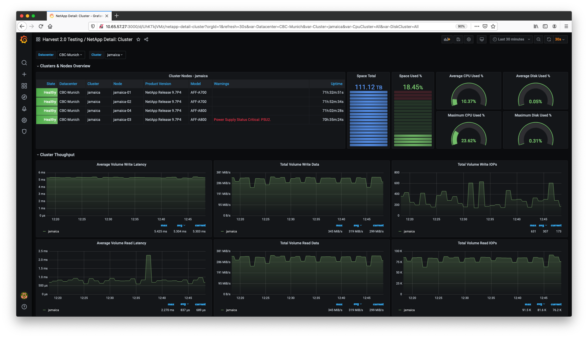
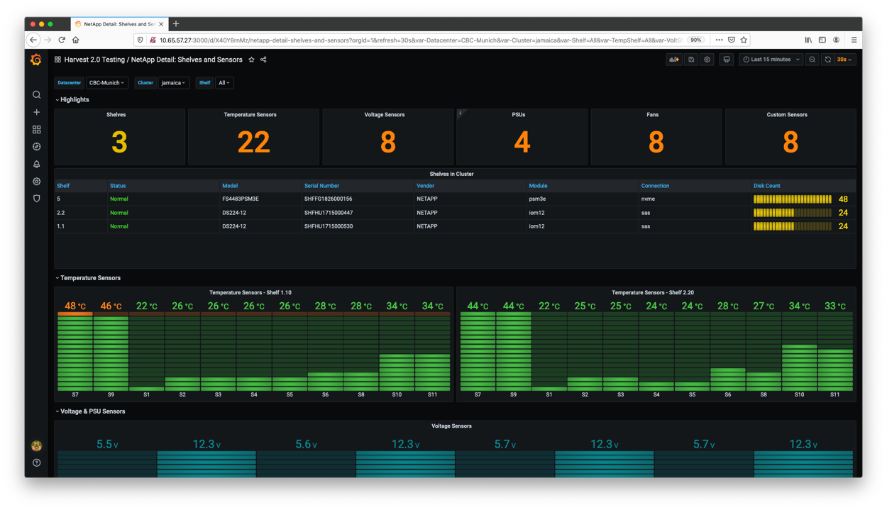

# What is NetApp Harvest?

> Harvest is the open-metrics endpoint for ONTAP and StorageGRID

NetApp Harvest brings observability to ONTAP and StorageGRID clusters.
Harvest collects performance, capacity and hardware metrics from ONTAP and StorageGRID,
transforms them, and routes them to your choice of time-series database.

The included Grafana dashboards deliver the datacenter insights you need, while
new metrics can be collected with a few edits of the included template files.

Harvest is open-source, built with Go, released under an [Apache2 license](https://github.com/NetApp/harvest/blob/main/LICENSE),
and offers [great flexibility](ARCHITECTURE.md) in how you collect, augment, and export your datacenter metrics.

To get started, follow our quickstart guide or install Harvest.

# Community

There is a vibrant community of Harvest users
on [Discord](https://github.com/NetApp/harvest/blob/main/SUPPORT.md#getting-help)
and GitHub [discussions](https://github.com/NetApp/harvest/discussions). Come join! :wave:

# Documentation

:closed_book: https://netapp.github.io/harvest/

---

Developed with :blue_heart: by <strong><a href="https://netapp.com">NetApp</a></strong> - <a href="https://www.netapp.com/us/company/trust-center/index.aspx">Privacy Policy</a>

