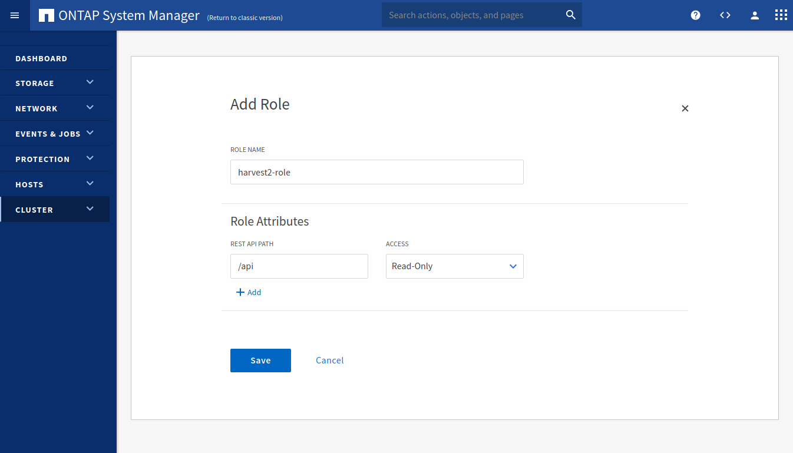
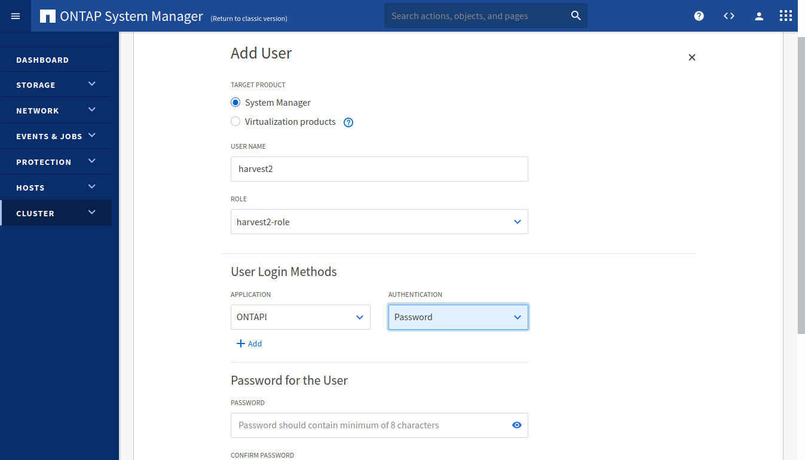

# ZapiPerf Collector

ZapiPerf collects performance metrics from ONTAP systems using the ZAPI protocol. The collector is designed to be easily extendible to collect new objects or to collect additional counters from already configured objects. (The [default configuration](../../../conf/zapiperf/default.yaml) file contains 25 objects)

Note: The main difference between this collector and the Zapi collector is that ZapiPerf collects only the `perf` subfamily of the ZAPIs. Additionally, ZapiPerf always calculates final values from deltas of two subsequent polls (therefore data is emitted only after the second poll).

## Configuration

The parameters of the collector are distributed across three files:
- Harvest configuration file (default: `harvest.yml`)
- ZapiPerf configuration file (default: `conf/zapiperf/default.yaml`)
- Each object has its own configuration file (located in `conf/zapiperf/cdot/` and `conf/zapiperf/7mode/` for cDot and 7Mode systems respectively)

With the exception of `addr`, `datacenter` and `auth_style`, all other parameters of the ZapiPerf collector can be defined in either of these three files. Parameters defined in the lower-level file, override parameters in the higher-level file. This allows the user to configure each objects individually, or use same parameters for all objects.

For the sake of brevity, these parameters are described only in the section [ZapiPerf configuration file](#zapiperf-configuration-file).


### Harvest configuration file

Parameters in poller section should define (at least) the address and authentication method of the target system:

| parameter              | type         | description                                      | default                |
|------------------------|--------------|--------------------------------------------------|------------------------|
| `addr`             | string, required | address (IP or FQDN) of the ONTAP system         |                        |
| `datacenter`       | string, required | name of the datacenter where the target system is located |               |
| `auth_style` | string, optional | authentication method: either `basic_auth` or `certificate_auth` | `basic_auth` |
| `ssl_cert`, `ssl_key` | string, optional | full path of the SSL certificate and key pairs (when using `certificate_auth`) | |
| `username`, `password` | string, optional | full path of the SSL certificate and key pairs (when using `basic_auth`) | |

It is recommended creating a read-only user on the ONTAP system dedicated to Harvest. See section [Authentication](#authentication) for guidance.

We can define the configuration file of the collector. If no configuration file is specified, the default configuration file (`conf/zapiperf/default.yaml`) will be used and if the file `conf/zapiperf/default.yaml` is present, it will be merged to the default one. If we specify our own configuration file for the collector, it can have any name, and it will not be merged.

Examples:

Define a poller that will run the ZapiPerf collector using its default configuration file:

```yaml
Pollers:
  jamaica:  # name of the poller
    datacenter: munich
    addr: 10.65.55.2
    auth_style: basic_auth
    username: harvest
    password: 3t4ERTW%$W%c
    collectors:
      - ZapiPerf # will use conf/zapiperf/default.yaml and optionally merge with conf/zapiperf/custom.yaml
```

Define a poller that will run the ZapiPerf collector using a custom configuration file:

```yaml
Pollers:
  jamaica:  # name of the poller
    addr: 10.65.55.2
    auth_style: basic_auth
    username: harvest
    password: 3t4ERTW%$W%c
    collectors:
      - ZapiPerf:
        - limited.yaml # will use conf/zapiperf/limited.yaml
        # if more templates are added, they will be merged
```

### Collector configuration file

This configuration file (the "template") contains a list of objects that should be collected and the filenames of their configuration (explained in the next section).

Additionally, this file contains the parameters that are applied as defaults to all objects. (As mentioned before, any of these parameters can be defined in the Harvest or object configuration files as well).

| parameter              | type         | description                                      | default                |
|------------------------|--------------|--------------------------------------------------|------------------------|
| `use_insecure_tls` | bool, optional | skip verifying TLS certificate of the target system | `false`               |
| `client_timeout`   | int, optional  | max seconds to wait for server response             | `10`                  |
| `batch_size`       | int, optional  | max instances per API request                       | `500`                 |
| `latency_io_reqd`  | int, optional  | threshold of IOPs for calculating latency metrics (latencies based on very few IOPs are unreliable) | `100`  |
| `schedule`         | list, required | the poll frequencies of the collector/object, should include exactly these three elements in the exact same other: | |
|    - `counter`         | duration (Go-syntax) | poll frequency of updating the counter metadata cache (example value: `1200s` = `20m`) | |
|    - `instance`         | duration (Go-syntax) | poll frequency of updating the instance cache (example value: `600s` = `10m`) | |
|    - `data`         | duration (Go-syntax) | poll frequency of updating the data cache (example value: `60s` = `1m`)<br /><br />**Note** Harvest allows defining poll intervals on sub-second level (e.g. `1ms`), however keep in mind the following:<br /><ul><li>API response of an ONTAP system can take several seconds, so the collector is likely to enter failed state if the poll interval is less than `client_timeout`.</li><li>Small poll intervals will create significant workload on the ONTAP system, as many counters are aggregated on-demand.</li><li>Some metric values become less significant if they are calculated for very short intervals (e.g. latencies)</li></ul> | |

The template should define objects in the `objects` section. Example:

```yaml

objects:
  SystemNode:             system_node.yaml
  HostAdapter:            hostadapter.yaml
```

Note that for each object we only define the filename of the object configuration file. The object configuration files are located in subdirectories matching to the ONTAP version that was used to create these files. It is possible to have multiple version-subdirectories for multiple ONTAP versions. At runtime, the collector will select the object configuration file that closest matches to the version of the target ONTAP system. (A mismatch is tolerated since ZapiPerf will fetch and validate counter metadata from the system.)

### Object configuration file

The Object configuration file ("subtemplate") should contain the following parameters:

| parameter              | type         | description                                      | default                |
|------------------------|--------------|--------------------------------------------------|------------------------|
| `name`                 | string       | display name of the collector that will collect this object |             |
| `object`               | string       | short name of the object                         |                        |
| `query`                | string       | raw object name used to issue a ZAPI request     |                        |
| `counters`             | list         | list of counters to collect (see notes below) |                        |
| `instance_key`         | string | label to use as instance key (either `name` or `uuid`) |                        |
| `override` | list of key-value pairs | override counter properties that we get from ONTAP (allows to circumvent ZAPI bugs) | |
| `plugins`  | list | plugins and their parameters to run on the collected data | |
| `export_options` | list | parameters to pass to exporters (see notes below) | |

#### `counters`

This section defines the list of counters that will be collected. These counters can be labels, numeric metrics or histograms. The exact property of each counter is fetched from ONTAP and updated periodically.

Some counters require a "base-counter" for post-processing. If the base-counter is missing, ZapiPerf will still run, but the missing data won't be exported.

The display name of a counter can be changed with `=>` (e.g. `nfsv3_ops => ops`). The special counter `instance_name` will be renamed to the value of `object` by default.

Counters that are stored as labels will only be exported if they are included in the `export_options` section.

#### `export_options`

Parameters in this section tell the exporters how to handle the collected data. The set of parameters varies by exporter. For [Prometheus](../../exporters/prometheus/README.md) and [InfluxDB]((../../exporters/influxdb/README.md)) exporters, the following parameters can be defined:

* `instances_keys` (list): display names of labels to export with each data-point
* `instance_labels` (list): display names of labels to export as a separate data-point
* `include_all_labels` (bool): export all labels with each data-point (overrides previous two parameters)

#### Creating/editing subtemplates

Instead of editing one of the existing subtemplates, create a copy and edit that. This way, your custom template will not be overwritten when upgrading Harvest.

Harvest provides a tool for exploring what objects and counters are available on ONTAP systems. This tool can help create or edit subtemplates. Examples:

```sh
$ harvest zapi --poller <poller> show objects
  # will print list of perf objects
$ harvest zapi --poller <poller> show counters --object volume
  # will print list of counters in the volume objects
$ harvest zapi --poller <poller> show counters --object volume
  # will print raw data of all counters in the volume objects
```

Replace `<poller>` with the name of one of your ONTAP pollers.

## Authentication

The collector requires an authentication (`auth_style`) method to connect to the ONTAP server. This can be either `basic_auth` or `certificate_auth`. It is highly recommended to create a read-only harvest user on your ONTAP server and use certificate-based TLS authentication.

### Creating ONTAP user
There are two ways to create a read-only user:
* Create a user with read-only access to **all** API objects
* Limit the harvest user to the handful of APIs that Harvest collects

The second option has a smaller attack surface, but each time you want to collect counters of a new object, you will need to update the user's privileges.

Below we explain how to create an ONTAP user and role for Harvest using ONTAP System Manager (Classic interface & New interface) and CLI.

#### System Manager: New interface

*Note: in this section we add a user with read-access to all API objects. For limited access, use either the classic interface or the CLI*


Open System Manager. Click on *CLUSTER* in the left menu bar, *Settings* and *Users and Roles*.
<center></center>

In the right column, under *Roles*, click on *Add* to add a new role.
<center></center>

Choose a role name (e.g. *harvest2-role*). In the *REST API PATH* field type */api* and select *Read-Only* as for *ACCESS*. Click on *Save*. 

<center></center>

In the left column, under *Users*, click on *Add* to create a new user. Choose a username. Under *Role*, select the role that we just created. Under *User Login Methods* select *ONTAPI*, and select one of the two authentication methods. Type in a password if you chose *Password*. Click on *Save*
<center></center>

If you chose *Password*, you can add the username and password to the Harvest configuration file and start Harvest. If you chose *Certificate* jump to [Using Certificate Authentication](#using-certificate-authentication) to generate certificates files.

#### System Manager: Classic interface

Open System Manager. Click on the Settings icon on the top-right corner of the window.
<center></center>

Click on *Roles* in the left menu bar and click *Add*. Choose a role name (e.g. *harvest2-role*).

<center></center>

If you want to give Harvest read access to **all** API objects, then under *Role Attributes* click on *Add*, under *Command* type *DEFAULT*, leave *Query* empty, select *readonly* under *Access Level*, click on *OK* and *Add*.

If you want to limit the API objects, then under *Role Attributes*, add each of the following lines as an entry. All of those should be entered under the *Command* column, *Query* should be left blank, and *Access Level* should be selected *readonly*.

* cluster
* lun
* snapmirror
* statistics
* storage aggregate
* storage disk
* storage shelf
* system node
* version
* volume

After you click on *Add*, this is what you should see:

<center></center>

Now we need to create a user. Click on *Users* in the left menu bar and *Add*. Choose a username and password. Under *User Login Methods*, click on *Add*, select *ontapi* as *Application* and select the role that we just created as *Role*. Click on *Add* in the pop-up window to save.

<center></center>

Now add the username and password to `harvest.yml` and start Harvest.

#### ONTAP CLI

Login to the CLI of your ONTAP system (e.g. using SSH). First, we create a user role. If you want to give the user readonly access to **all** API objects, type in the following command:

```bash
security login role create -role harvest2-role -access readonly -cmddirname "DEFAULT"
```
If you want to give limited access, type in the following commands one-by-one:

```bash
security login role create -role harvest2-role -access readonly -cmddirname "version"
security login role create -role harvest2-role -access readonly -cmddirname "cluster"
security login role create -role harvest2-role -access readonly -cmddirname "lun"    
security login role create -role harvest2-role -access readonly -cmddirname "snapmirror"
security login role create -role harvest2-role -access readonly -cmddirname "statistics"
security login role create -role harvest2-role -access readonly -cmddirname "storage aggregate"
security login role create -role harvest2-role -access readonly -cmddirname "storage disk"     
security login role create -role harvest2-role -access readonly -cmddirname "system node"
security login role create -role harvest2-role -access readonly -cmddirname "storage shelf"
security login role create -role harvest2-role -access readonly -cmddirname "volume" 
```

If you want to create a user with password authentication, type:
```bash
security login create -user-or-group-name harvest2 -application ontapi \
 -role harvest2-role -authentication-method password
```

If you want to use certificate authentication, type:

```bash
security login create -user-or-group-name harvest2 -application ontapi \
 -role harvest2-role -authentication-method cert
```

#### Using Certificate Authentication

Change directory to your Harvest home directory (replace `/opt/harvest/` if this is not the default):

```bash
$ cd /opt/harvest/
```

Generate an SSL cert and key pair with the following command. Note that it's preferred to generate these files using the hostname of the local machine. The command bellow assumes `debian8` as our hostname name and `harvest2` as the user we created in the previous step:

```bash
openssl req -x509 -nodes -days 1095 -newkey rsa:2048 -keyout cert/debian8.key \
 -out cert/debian8.pem  -subj "/CN=harvest2"
```

Next, open the public key (`debian8.pem` in our example) and copy all of its content. Login into your ONTAP CLI and run this command by replacing **CLUSTER** with the name of your cluster. 

```bash
security certificate install -type client-ca -vserver CLUSTER
```

Paste the public key content and hit enter. Output should be similar to this:

```bash
jamaica::> security certificate install -type client-ca -vserver jamaica 

Please enter Certificate: Press <Enter> when done
-----BEGIN CERTIFICATE-----                       
MIIDETCCAfmgAwIBAgIUP9EUXyl2BDSUOkNEcDU0yqbJ29IwDQYJKoZIhvcNAQEL
BQAwGDEWMBQGA1UEAwwNaGFydmVzdDItY2xpMzAeFw0yMDEwMDkxMjA0MDhaFw0y
MzEwMDktcGFueSBMdGQxFzAVBgNVBAMlc3QyLWNsaTMwggEiMA0tcGFueSBGCSqG
SIb3DQEBAQUAA4IBDwAwggEKAoIBAQCVVy25BeCRoGCJWFOlyUL7Ddkze4Hl2/6u
qye/3mk5vBNsGuXUrtad5XfBB70Ez9hWl5sraLiY68ro6MyX1icjiUTeaYDvS/76
Iw7HeXJ5Pyb/fWth1nePunytoLyG/vaTCySINkIV5nlxC+k0X3wWFJdfJzhloPtt
1Vdm7aCF2q6a2oZRnUEBGQb6t5KyF0/Xh65mvfgB0pl/AS2HY5Gz+~L54Xyvs+BY
V7UmTop7WBYl0L3QXLieERpHXnyOXmtwlm1vG5g4n/0DVBNTBXjEdvc6oRh8sxBN
ZlQWRApE7pa/I1bLD7G2AiS4UcPmR4cEpPRVEsOFOaAN3Z3YskvnAgMBAAGjUzBR
MB0GA1UdDgQWBBQr4syV6TCcgO/5EcU/F8L2YYF15jAfBgNVHSMEGDAWgBQr4syV
6TCcgO/5EcU/F8L2YYF15jAPBgNVHRMdfdfwerH/MA0GCSqGSIb^ECd3DQEBCwUA
A4IBAQBjP1BVhClRKkO/M3zlWa2L9Ztce6SuGwSnm6Ebmbs+iMc7o2N9p3RmV6Xl
h6NcdXRzzPAVrUoK8ewhnBzdghgIPoCI6inAf1CUhcCX2xcnE/osO+CfvKuFnPYE
WQ7UNLsdfka0a9kTK13r3GMs09z/VsDs0gD8UhPjoeO7LQhdU9tJ/qOaSP3s48pv
sYzZurHUgKmVOaOE4t9DAdevSECEWCETRETA$Vbn%@@@%%rcdrctru65ryFaByb+
hTtGhDnoHwzt/cAGvLGV/RyWdGFAbu7Fb1rV94ceggE7nh1FqbdLH9siot6LlnQN
MhEWp5PYgndOW49dDYUxoauCCkiA
-----END CERTIFICATE-----


You should keep a copy of the CA-signed digital certificate for future reference.

The installed certificate's CA and serial number for reference:
CA: harvest2
Serial: 3FD1145F2976043012213d3009095534CCRDBD2

The certificate's generated name for reference: harvest2
```

Finally, we need to enable SSL authentication with the following command (replace **CLUSTER** with the name of your cluster):

```bash
security ssl modify -client-enabled true -vserver CLUSTER
```
