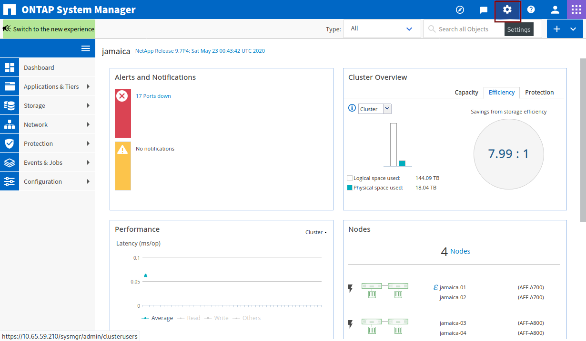

## Authentication

The collector requires an authentication (`auth_style`) method to connect to the ONTAP server. This can be either `basic_auth` or `certificate_auth`. It is highly recommended to create a read-only harvest user on your ONTAP server and use certificate-based TLS authentication.

### Creating ONTAP user
There are two ways to create a read-only user:
* Create a user with read-only access to **all** API objects
* Limit the harvest user to the handful of APIs that Harvest collects

The second option has a smaller attack surface, but each time you want to collect counters of a new object, you will need to update the user's privileges.

Below we explain how to create an ONTAP user and role for Harvest using ONTAP System Manager (Classic interface & New interface) and CLI.

#### System Manager: New interface

*Note: in this section we add a user with read-access to all API objects. For limited access, use either the classic interface or the CLI*


Open System Manager. Click on *CLUSTER* in the left menu bar, *Settings* and *Users and Roles*.
<center></center>

In the right column, under *Roles*, click on *Add* to add a new role.
<center></center>

Choose a role name (e.g. *harvest2-role*). In the *REST API PATH* field type */api* and select *Read-Only* as for *ACCESS*. Click on *Save*. 

<center></center>

In the left column, under *Users*, click on *Add* to create a new user. Choose a username. Under *Role*, select the role that we just created. Under *User Login Methods* select *ONTAPI*, and select one of the two authentication methods. Type in a password if you chose *Password*. Click on *Save*
<center></center>

If you chose *Password*, you can add the username and password to the Harvest configuration file and start Harvest. If you chose *Certificate* jump to [Using Certificate Authentication](#using-certificate-authentication) to generate certificates files.

#### System Manager: Classic interface

Open System Manager. Click on the Settings icon on the top-right corner of the window.
<center></center>

Click on *Roles* in the left menu bar and click *Add*. Choose a role name (e.g. *harvest2-role*).

<center></center>

If you want to give Harvest read access to **all** API objects, then under *Role Attributes* click on *Add*, under *Command* type *DEFAULT*, leave *Query* empty, select *readonly* under *Access Level*, click on *OK* and *Add*.

If you want to limit the API objects, then under *Role Attributes*, add each of the following lines as an entry. All of those should be entered under the *Command* column, *Query* should be left blank, and *Access Level* should be selected *readonly*.

* cluster
* lun
* snapmirror
* statistics
* storage aggregate
* storage disk
* storage shelf
* system node
* version
* volume

After you click on *Add*, this is what you should see:

<center></center>

Now we need to create a user. Click on *Users* in the left menu bar and *Add*. Choose a username and password. Under *User Login Methods*, click on *Add*, select *ontapi* as *Application* and select the role that we just created as *Role*. Click on *Add* in the pop-up window to save.

<center></center>

Now add the username and password to `harvest.yml` and start Harvest.

#### ONTAP CLI

Login to the CLI of your ONTAP system (e.g. using SSH). First, we create a user role. If you want to give the user readonly access to **all** API objects, type in the following command:

```bash
security login role create -role harvest2-role -access readonly -cmddirname "DEFAULT"
```
If you want to give limited access, type in the following commands one-by-one:

```bash
security login role create -role harvest2-role -access readonly -cmddirname "cluster"
security login role create -role harvest2-role -access readonly -cmddirname "lun"    
security login role create -role harvest2-role -access readonly -cmddirname "snapmirror"
security login role create -role harvest2-role -access readonly -cmddirname "statistics"
security login role create -role harvest2-role -access readonly -cmddirname "storage aggregate"
security login role create -role harvest2-role -access readonly -cmddirname "storage disk"     
security login role create -role harvest2-role -access readonly -cmddirname "storage shelf"
security login role create -role harvest2-role -access readonly -cmddirname "system health status show" 
security login role create -role harvest2-role -access readonly -cmddirname "system health subsystem show"  
security login role create -role harvest2-role -access readonly -cmddirname "system node"
security login role create -role harvest2-role -access readonly -cmddirname "version"
security login role create -role harvest2-role -access readonly -cmddirname "volume"
```

If you want to create a user with password authentication, type:
```bash
security login create -user-or-group-name harvest2 -application ontapi \
 -role harvest2-role -authentication-method password
```

If you want to use certificate authentication, type:

```bash
security login create -user-or-group-name harvest2 -application ontapi \
 -role harvest2-role -authentication-method cert
```

#### Using Certificate Authentication

See [comments here for troubleshooting](https://github.com/NetApp/harvest/issues/314#issuecomment-882120238) client certificate authentication 

Change directory to your Harvest home directory (replace `/opt/harvest/` if this is not the default):

```bash
$ cd /opt/harvest/
```

Generate an SSL cert and key pair with the following command. Note that it's preferred to generate these files using the hostname of the local machine. The command below assumes `debian8` as our hostname name and `harvest2` as the user we created in the previous step:

```bash
openssl req -x509 -nodes -days 1095 -newkey rsa:2048 -keyout cert/debian8.key \
 -out cert/debian8.pem  -subj "/CN=harvest2"
```

Next, open the public key (`debian8.pem` in our example) and copy all of its content. Login into your ONTAP CLI and run this command by replacing **CLUSTER** with the name of your cluster. 

```bash
security certificate install -type client-ca -vserver CLUSTER
```

Paste the public key content and hit enter. Output should be similar to this:

```bash
jamaica::> security certificate install -type client-ca -vserver jamaica 

Please enter Certificate: Press <Enter> when done
-----BEGIN CERTIFICATE-----                       
MIIDETCCAfmgAwIBAgIUP9EUXyl2BDSUOkNEcDU0yqbJ29IwDQYJKoZIhvcNAQEL
BQAwGDEWMBQGA1UEAwwNaGFydmVzdDItY2xpMzAeFw0yMDEwMDkxMjA0MDhaFw0y
MzEwMDktcGFueSBMdGQxFzAVBgNVBAMlc3QyLWNsaTMwggEiMA0tcGFueSBGCSqG
SIb3DQEBAQUAA4IBDwAwggEKAoIBAQCVVy25BeCRoGCJWFOlyUL7Ddkze4Hl2/6u
qye/3mk5vBNsGuXUrtad5XfBB70Ez9hWl5sraLiY68ro6MyX1icjiUTeaYDvS/76
Iw7HeXJ5Pyb/fWth1nePunytoLyG/vaTCySINkIV5nlxC+k0X3wWFJdfJzhloPtt
1Vdm7aCF2q6a2oZRnUEBGQb6t5KyF0/Xh65mvfgB0pl/AS2HY5Gz+~L54Xyvs+BY
V7UmTop7WBYl0L3QXLieERpHXnyOXmtwlm1vG5g4n/0DVBNTBXjEdvc6oRh8sxBN
ZlQWRApE7pa/I1bLD7G2AiS4UcPmR4cEpPRVEsOFOaAN3Z3YskvnAgMBAAGjUzBR
MB0GA1UdDgQWBBQr4syV6TCcgO/5EcU/F8L2YYF15jAfBgNVHSMEGDAWgBQr4syV
6TCcgO/5EcU/F8L2YYF15jAPBgNVHRMdfdfwerH/MA0GCSqGSIb^ECd3DQEBCwUA
A4IBAQBjP1BVhClRKkO/M3zlWa2L9Ztce6SuGwSnm6Ebmbs+iMc7o2N9p3RmV6Xl
h6NcdXRzzPAVrUoK8ewhnBzdghgIPoCI6inAf1CUhcCX2xcnE/osO+CfvKuFnPYE
WQ7UNLsdfka0a9kTK13r3GMs09z/VsDs0gD8UhPjoeO7LQhdU9tJ/qOaSP3s48pv
sYzZurHUgKmVOaOE4t9DAdevSECEWCETRETA$Vbn%@@@%%rcdrctru65ryFaByb+
hTtGhDnoHwzt/cAGvLGV/RyWdGFAbu7Fb1rV94ceggE7nh1FqbdLH9siot6LlnQN
MhEWp5PYgndOW49dDYUxoauCCkiA
-----END CERTIFICATE-----


You should keep a copy of the CA-signed digital certificate for future reference.

The installed certificate's CA and serial number for reference:
CA: harvest2
Serial: 3FD1145F2976043012213d3009095534CCRDBD2

The certificate's generated name for reference: harvest2
```

Finally, we need to enable SSL authentication with the following command (replace **CLUSTER** with the name of your cluster):

```bash
security ssl modify -client-enabled true -vserver CLUSTER
```
