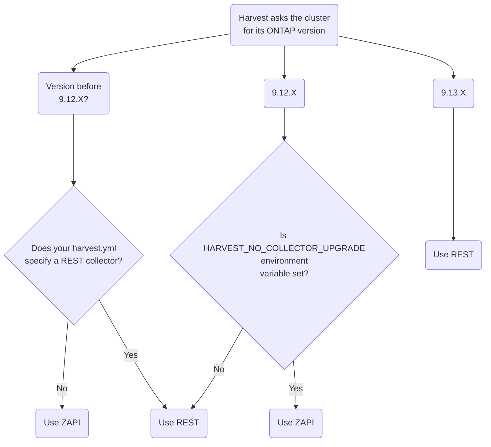

# REST Strategy

## Status <!-- one of: In Progress, Accepted, Rejected, Superseded, Deprecated -->

Accepted

## Context

ONTAP has published a customer product communiqué [(CPC-00410)](https://mysupport.netapp.com/info/communications/ECMLP2880232.html?access=a)
announcing that ZAPIs will reach end of availability (EOA) in ONTAP `9.13.1` released Q2 2023.

This document describes how Harvest handles the ONTAP transition from ZAPI to REST. 
In most cases, no action is required on your part.

## Harvest API Transition

By default, Harvest will use ZAPIs until ONTAP version `9.12.1`.
Beginning with ONTAP `9.12.1` and after, Harvest will default to REST.

Harvest includes a full set of REST templates that export identical metrics as the included ZAPI templates.
No changes to dashboards or downstream metric-consumers will be required. 
See [below](#ive-added-counters-to-existing-zapi-templates-will-those-counters-work-in-rest) if you have 
added metrics to the Harvest out-of-the-box templates.

Read on if you want to know how you can use REST sooner, or you want to take advantage of REST-only features in ONTAP.

## Frequently Asked Questions

### How does Harvest decide whether to use REST or ZAPI APIs?

Harvest asks the cluster for its ONTAP version:

* If the version is earlier than `9.12.1`, Harvest will use the collector(s) defined in your `harvest.yml`.
* If the version is `9.12.1` or later, Harvest will use REST, unless the [HARVEST_NO_COLLECTOR_UPGRADE](#im-using-ontap-version-912x-but-i-want-to-continue-using-zapis-how-do-i-do-that) environment variable is set.
  When the environment variable is set, Harvest will use ZAPIs unless the cluster no longer talks ZAPI. 


### Why would I switch to REST before `9.13.1`?

- You have advanced use cases to validate before ONTAP removes ZAPIs in `9.13.1`
- You want to take advantage of new ONTAP features that are only available via REST (e.g. cloud features, event remediation's, name services, cluster peers, etc.)
- You want to collect a metric that is not available via ZAPI
- You want to collect a metric from the ONTAP CLI. The REST API includes a private CLI pass-through to access any ONTAP CLI command

### Can I start using REST before `9.13.1`?

Yes. Several customers already are. Be aware of the following limitations:

1. Harvest collects config counters via REST by enabling the `Rest` collector in your `harvest.yml`,
   but ONTAP did not include performance counters via REST until [9.11.1](https://docs.netapp.com/us-en/ontap-automation/migrate/performance-counters.html#accessing-performance-counters-using-the-ontap-rest-api).
   That means Harvest's `RestPerf` collector won't work until `9.11.1`.
   ONTAP supports a subset of performance counters in `9.11.1`. The full set is available in `9.12.1`.

2. There may be performance metrics missing from versions of ONTAP earlier than `9.11.1`.

### A counter is missing from REST. What do I do?

The Harvest team has ensured that all the out-of-the-box ZAPI templates have matching REST templates with the same metrics.
Any additional counters you have added may be missing in REST. 

Join the [Harvest discord channel](https://github.com/NetApp/harvest/blob/main/SUPPORT.md#getting-help) and ask us about the counter.
Sometimes we may know which release the missing counter is coming in, otherwise we can point you to the ONTAP
process to [request new counters](https://kb.netapp.com/Advice_and_Troubleshooting/Data_Storage_Software/ONTAP_OS/How_to_request_a_feature_for_ONTAP_REST_API).

### Can I use the REST and ZAPI collectors at the same time?

Yes. Harvest ensures that the same resources are not collected from both collectors.

When there is potential duplication, Harvest resolves the conflict in the order collectors are defined for your poller.
For example, with the following poller definition, 

```yaml
aff-251:
    datacenter: dc-1
    addr: 10.1.1.1
    collectors:
        - Zapi
        - Rest
```

when collecting `disk` resources, the Zapi collector will be used since it is listed first, unless the cluster no longer
speaks ZAPI, in which case REST will be used.

If you want the REST collector to be selected before the ZAPI one, change the order in the `collectors` section
so `Rest` comes before `Zapi`.

If the resource does not exist for the first collector, the second one will be tried. For example, when
collecting `nfs_client` resources, the Zapi collector will not run because `nfs_client` objects are only available via
REST.

### I've added counters to existing ZAPI templates. Will those counters work in REST?

`ZAPI` config metrics often have a REST equivalent that can be found in ONTAP's [ONTAPI to REST mapping document](https://library.netapp.com/ecm/ecm_download_file/ECMLP2882104).

ZAPI performance metrics may be missing in REST. If you have added new metrics or templates to the `ZAPIPerf` collector, those metrics likely aren't available via REST. 
You can [check if the performance counter is available](https://docs.netapp.com/us-en/ontap-automation/migrate/performance-counters.html#discover-the-available-performance-counter-tables) 
or [ask the Harvest team on Discord](#a-counter-is-missing-from-rest-what-do-i-do).

### I'm using ONTAP version 9.12.X, but I want to continue using ZAPIs. How do I do that?

Set the environment variable `HARVEST_NO_COLLECTOR_UPGRADE=1` and Harvest will not 
upgrade your collector from ZAPI to REST.

## Reference

Table of ONTAP versions, dates and API notes.

| ONTAP<br/>version | Release<br/>Date | ONTAP<br/>Notes                                                                                                                                                                         |
|------------------:|------------------|-----------------------------------------------------------------------------------------------------------------------------------------------------------------------------------------|
|          `9.11.1` | Q2 2022          | First version with [REST performance metrics](https://docs.netapp.com/us-en/ontap-automation/migrate/performance-counters.html#accessing-performance-counters-using-the-ontap-rest-api) |
|          `9.12.1` | Q4 2022          | ZAPIs still supported - REST performance metrics have parity with Harvest collected ZAPI performance metrics                                                                            |
|          `9.13.1` | Q2 2023          | ZAPIs removed. REST only release - REST config and performance parity with ZAPIs                                                                                                        |
