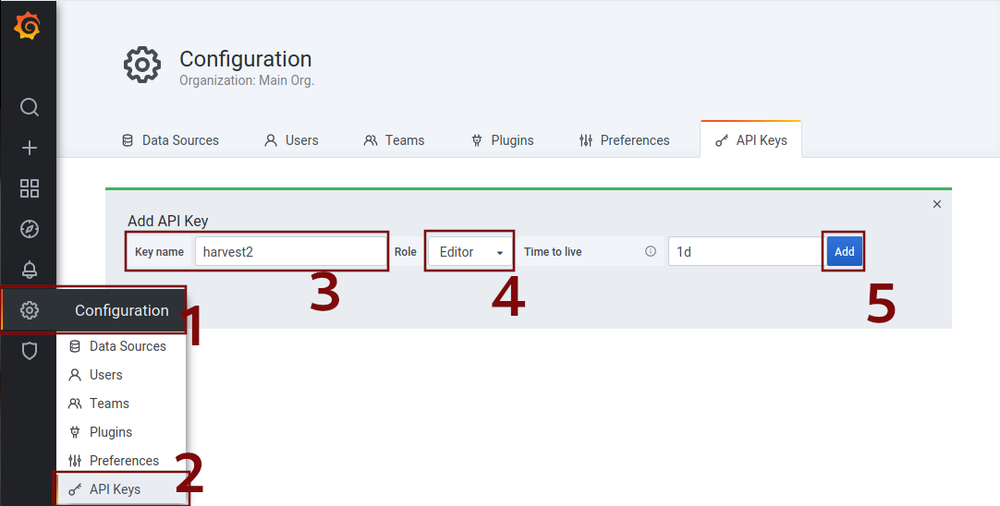
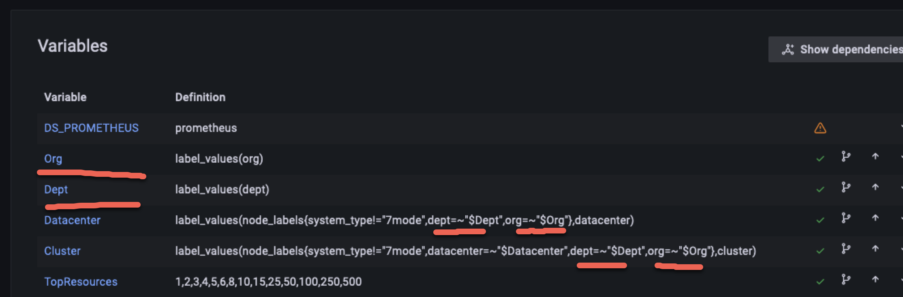

Harvest can be used to import dashboards to Grafana.

The `bin/harvest grafana` utility requires the address (hostname or IP), port of the Grafana server,
and a Grafana API token. The port can be omitted if Grafana is configured to redirect the URL. Use the `-d` flag to
point to the directory that contains the dashboards.

### Grafana API token

The utility tool asks for an API token which can be generated from the Grafana web-gui.



Click on `Configuration` in the left menu bar (1), click on `API Keys` (2) and click on the `New API Key` button. Choose
a Key name (3), choose `Editor` for role (4) and click on add (5). Copy the generated key and paste it in your terminal
or add the token to the `Tools` section of your configuration file. (see below)

For example, let's say your Grafana server is on `http://my.grafana.server:3000` and you want to import the
Prometheus-based dashboards from the `grafana` directory. You would run this:

```
$ bin/harvest grafana import --addr my.grafana.server:3000
```

Similarly, to export:

```
$ bin/harvest grafana export --addr my.grafana.server:3000 --directory /path/to/export/directory --serverfolder grafanaFolderName
```

By default, the dashboards are connected to the `Prometheus` datasource defined in Grafana. If your datasource has a
different name, use the `--datasource` flag during import/export.

### CLI

The `bin/harvest grafana` tool includes CLI help when passing the `--help` command line argument flag like so:

```bash
bin/harvest grafana import --help
```

The `labels` argument requires more explanation.

#### Labels

The grafana import `--labels` argument goes hand-in-hand with a poller's `Labels` section described [here](https://netapp.github.io/harvest/latest/configure-harvest-basic/#labels).
`Labels` are used to add additional key-value pairs to a poller's metrics.

When you run `bin/harvest grafana import`, you may optionally pass a set of labels like so:

`bin/harvest grafana import --labels org --labels dept`

This will cause Harvest to do the following for each dashboard:
1. Parse each dashboard and add a new variable for each label passed on the command line
2. Modify each dashboard variable to use the new label variable(s) in a chained query.

Here's an example:

```
bin/harvest grafana import --labels "org,dept"
```

This will add the `Org` and `Dept` variables, as shown below, and modify the existing variables as shown.

Results in

