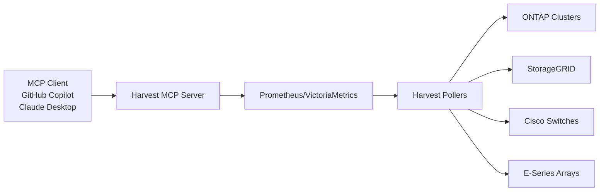

# Harvest Model Context Protocol Server

The Harvest Model Context Protocol (MCP) server provides MCP clients like GitHub Copilot, Claude Desktop, and other large language models (LLMs) access to your infrastructure monitoring data collected by Harvest from ONTAP, StorageGRID, E-Series and Cisco Nexus Switches.

## What is MCP?

The [Model Context Protocol](https://modelcontextprotocol.io/docs/getting-started/intro) (MCP) is an open standard that enables interactions between MCP clients and external data sources.
The Harvest MCP server provides APIs for large language models (LLMs) to query your Harvest-collected open-metrics data. These APIs enable intelligent data analysis and insights.

## What You Can Ask

The Harvest MCP server allows you to ask natural language questions about your infrastructure monitoring data. Here are some example queries:

**Simple Health Checks**

- "What's the overall health of my infrastructure?"
- "Are there any active alerts I should know about?"

**Capacity Analysis**

- "Which volumes are running out of space?"
- "Show me the top 5 volumes by utilization"
- "Analyze storage growth trends over the past month"

**Performance Investigation**

- "Which systems are experiencing high latency?"
- "Which volumes have performance issues?"
- "Show me performance bottlenecks across my clusters"

## Architecture

The Harvest MCP Server operates as a lightweight service that:

1. Connects to your existing Prometheus/VictoriaMetrics instance containing Harvest data
2. Provides a standardized MCP interface for MCP clients (GitHub Copilot, Claude Desktop, etc.)
3. Enables natural language queries against your infrastructure data

## Prerequisites

- Prometheus or VictoriaMetrics instance with Harvest data
- Docker environment for running the MCP server
- Network connectivity from MCP server to your time series database

For information about Harvest deployment and configuration, see:

- [Harvest Concepts](../concepts.md)
- [Installation Overview](../install/overview.md)
- [System Requirements](../system-requirements.md)

## Next Steps

- [Install the MCP Server](installation.md)
- [Configure Environment Variables](installation.md#configuration)
- Try the [Usage Examples](examples.md)