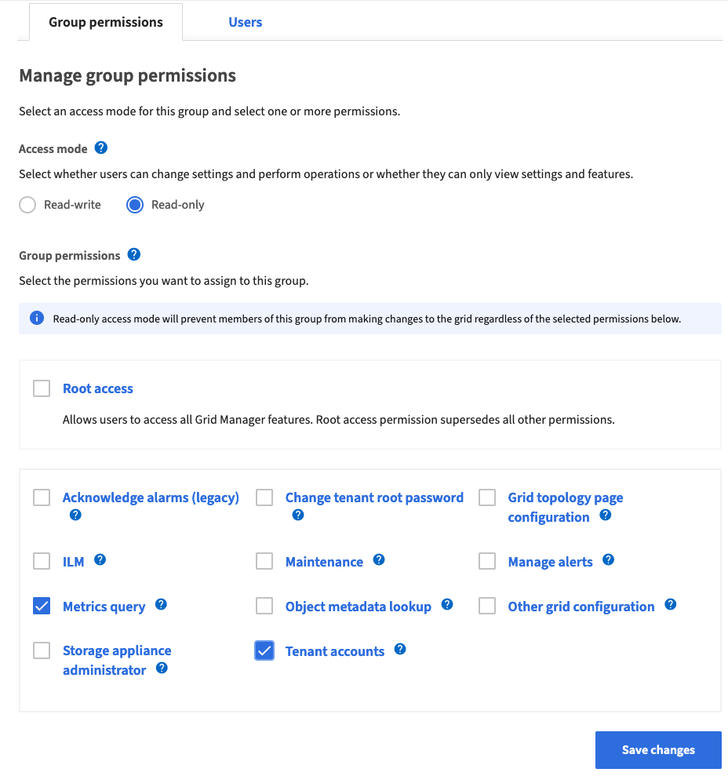
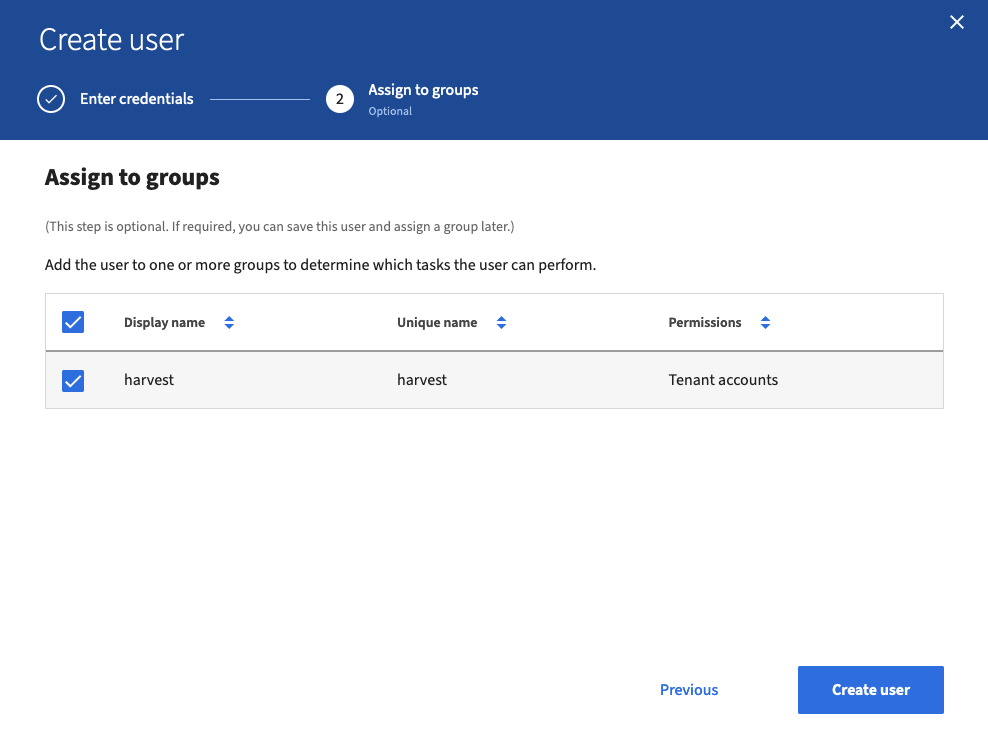

## Prepare StorageGRID cluster

NetApp Harvest requires login credentials to access StorageGRID hosts. Although, a generic admin account can be used, it
is better to create a dedicated monitoring user with the fewest permissions.

Here's a summary of what we're going to do

1. Create a StorageGRID group with the necessary capabilities that Harvest will use to auth and collect data
2. Create a user assigned to the group created in step #1.

## Create StorageGRID group permissions

These steps are
documented [here](https://docs.netapp.com/us-en/storagegrid-116/admin/managing-admin-groups.html#create-an-admin-group).

You will need a root or admin account to create a new group permission.

1. Select CONFIGURATION > Access control > Admin groups
2. Select `Create group`
3. Select `Local group`
4. Enter a display name for the group, which you can update later as required. For example, `Harvest` or `monitoring`.
5. Enter a unique name for the group, which you cannot update later.
6. Select `Continue`
7. On the `Manage group permissions` screen, select the permissions you want. At a minimum, Harvest requires
   the `Tenant accounts` permission.
8. Select `Save changes`

## Create a StorageGRID user

These steps are documented [here](https://docs.netapp.com/us-en/storagegrid-116/admin/managing-users.html).

You will need a root or admin account to create a new user.

1. Select CONFIGURATION > Access control > Admin users
2. Select `Create user`
3. Enter the user’s full name, a unique username, and a password.
4. Select `Continue`.
5. Assign the user to the previously created `harvest` group.
6. Select Create user and select Finish.

## Reference

See [group permissions](https://docs.netapp.com/us-en/storagegrid-116/admin/managing-admin-groups.html#group-permissions)
for more information on StorageGRID permissions.