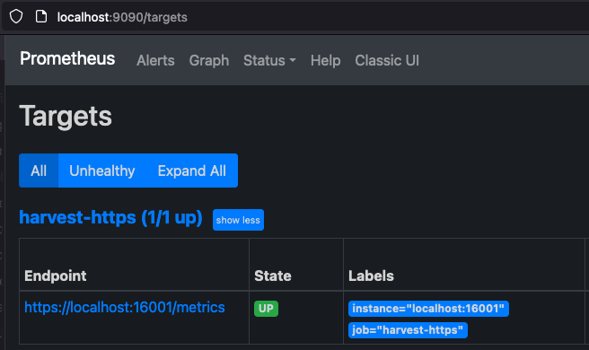

# Prometheus Exporter

???+ note "Prometheus Install"

    The information below describes how to setup Harvest's Prometheus exporter. 
    If you need help installing or setting up Prometheus, check 
    out [their documentation](https://prometheus.io/docs/prometheus/latest/getting_started/).

## Overview

The Prometheus exporter is responsible for:

- formatting metrics into the Prometheus [line protocol](https://prometheus.io/docs/instrumenting/exposition_formats/)
- creating a web-endpoint on `http://<ADDR>:<PORT>/metrics` (or `https:` if TLS is enabled) for Prometheus to scrape

A web end-point is required because Prometheus scrapes Harvest by polling that end-point.

In addition to the `/metrics` end-point, the Prometheus exporter also serves an overview of all metrics and collectors
available on its root address `scheme://<ADDR>:<PORT>/`.

Because Prometheus polls Harvest, remember
to [update your Prometheus configuration](#configure-prometheus-to-scrape-harvest-pollers) and tell Prometheus how to
scrape each poller.

## How should I configure the Prometheus exporter?

There are several ways to configure the Prometheus exporter with various trade-offs outlined below:

- a per-poller prom_port in the `Pollers` section
- a port range in the `Exporters` section
- a single port in the `Exporters` section
- embedded exporters in the `Pollers` section

We recommend the first two options, using a per-poller `prom_port` or `port_range`, since they work for the majority of 
use cases and are the easiest to manage.

Use `prom_port` when you want the most control over the Prometheus port with the least amount of management.
Use `port_range` when you want Harvest to manage the port numbers for you,
but be aware that the port numbers depend on the order of pollers in your `harvest.yml`.
You need to keep that order consistent otherwise it will appear that you have lost data.  

| Name                                       | Pros                                                                                                                                   | Cons                                                                                                                                                                                                                                                                                                                                                                                                                                                                                                                                                                                   | Notes                                                                                                                                                                |
|--------------------------------------------|----------------------------------------------------------------------------------------------------------------------------------------|----------------------------------------------------------------------------------------------------------------------------------------------------------------------------------------------------------------------------------------------------------------------------------------------------------------------------------------------------------------------------------------------------------------------------------------------------------------------------------------------------------------------------------------------------------------------------------------|----------------------------------------------------------------------------------------------------------------------------------------------------------------------|
| [prom_port](#per-poller-prom_port)         | Precisely control each Poller's Prometheus exporter port. The port is defined in one place, beside each poller.                        | You have to manage which port each poller should use.                                                                                                                                                                                                                                                                                                                                                                                                                                                                                                                                  | Start with this until you outgrow it. Many folks never do.                                                                                                           |
| [port_range](#port-range)                  | Less to manage since Harvest assigns the port numbers for you based on the order of the pollers in your `harvest.yml`                  | You need to be mindful of the order of pollers in your `harvest.yml` file and be careful about changing that order when adding/removing pollers. Reordering will cause the Prometheus port to change. Since Prometheus includes the port in the `instance` label, changing the port causes Prometheus to treat metrics with different ports as different instances. That means it will appear that you have lost data because the metrics with the new port are distinct from the metrics with the older port. See [#2782](https://github.com/NetApp/harvest/issues/2782) for details. | Less to manage, but makes sure you understand how to [control the order of your pollers](#port-range).                                                               |
| [port in Exporters](#single-port-exporter) | Precisely control each Poller's Prometheus exporter port.<br>Can define multiple Prometheus exporters, each with custom configuration. | Similar to `prom_port` but with an unnecessary level of indirection that makes you repeat yourself.                                                                                                                                                                                                                                                                                                                                                                                                                                                                                    | Exporter that Harvest always shipped with. Most folks should use `prom_port` unless they need to configure many instances of the Prometheus exporter, which is rare. |
| [embedded exporter](#embedded-exporter)    | All the pros of `port in Exporters` but without the unnecessary indirection                                                            | Removes the level of indirection and allows you to define the exporter in one place, but more verbose than per-poller `prom_port`.                                                                                                                                                                                                                                                                                                                                                                                                                                                     | Most folks should use `prom_port` unless they need to configure many instances of the Prometheus exporter, which is rare.                                            |

## Parameters

All parameters of the exporter are defined in the `Exporters` section of `harvest.yml`.

An overview of all parameters:

| parameter                                 | type                                           | description                                                                                                                                                                                                                   | default                                                                                                                                        |
|-------------------------------------------|------------------------------------------------|-------------------------------------------------------------------------------------------------------------------------------------------------------------------------------------------------------------------------------|------------------------------------------------------------------------------------------------------------------------------------------------|
| `add_meta_tags`                           | bool, optional                                 | add `HELP` and `TYPE` [metatags](https://prometheus.io/docs/instrumenting/exposition_formats/#comments-help-text-and-type-information) to metrics (currently no useful information, but required by some tools)               | `false`                                                                                                                                        |
| [`allow_addrs`](#allow_addrs)             | list of strings, optional                      | allow access only if host matches any of the provided addresses                                                                                                                                                               |                                                                                                                                                |
| [`allow_addrs_regex`](#allow_addrs_regex) | list of strings, optional                      | allow access only if host address matches at least one of the regular expressions                                                                                                                                             |                                                                                                                                                |
| `cache_max_keep`                          | string (Go duration format), optional          | maximum amount of time metrics are cached (in case Prometheus does not timely collect the metrics)                                                                                                                            | `5m`                                                                                                                                           |
| [`disk_cache`](#disk_cache)               | object, optional                               | disk-based cache configuration                                                                                                                                                                        |                                                                                                                                                |
| `global_prefix`                           | string, optional                               | add a prefix to all metrics (e.g. `netapp_`)                                                                                                                                                                                  |                                                                                                                                                |
| `local_http_addr`                         | string, optional                               | address of the HTTP server Harvest starts for Prometheus to scrape:<br />use `localhost` to serve only on the local machine<br />use `0.0.0.0` (default) if Prometheus is scrapping from another machine                      | `0.0.0.0`                                                                                                                                      |
| `port_range`                              | int-int (range), overrides `port` if specified | lower port to upper port (inclusive) of the HTTP end-point to create when a poller specifies this exporter. Starting at lower port, each free port will be tried sequentially up to the upper port.                           |                                                                                                                                                |
| `port`                                    | int, required if port_range is not specified   | port of the HTTP end-point                                                                                                                                                                                                    |                                                                                                                                                |
| `sort_labels`                             | bool, optional                                 | sort metric labels before exporting. [VictoriaMetrics](https://github.com/NetApp/harvest/issues/756) requires this otherwise stale metrics are reported.                                                                      | `false`                                                                                                                                        |
| `tls`                                     | `tls`                                          | optional                                                                                                                                                                                                                      | If present, enables TLS transport. If running in a container, see [note](https://github.com/NetApp/harvest/issues/672#issuecomment-1036338589) |         
| tls `cert_file`, `key_file`               | **required** child of `tls`                    | Relative or absolute path to TLS certificate and key file. TLS 1.3 certificates required.<br />FIPS complaint P-256 TLS 1.3 certificates can be created with `bin/harvest admin tls create server`, `openssl`, `mkcert`, etc. |                                                                                                                                                |

### Per-poller prom_port

Define a Prometheus exporter in the `Exporters` section of your `harvest.yml` file, use that exporter in `Defaults`, 
and then each poller lists its `prom_port` in the `Pollers` section.

```yaml
Exporters:
  my_prom:
    exporter: Prometheus
    add_meta_tags: true
    sort_labels: true

Defaults:
  auth_style: basic_auth
  username: harvest
  password: pass
  exporters:
    - my_prom
```

Then update your pollers in the `Pollers` section of your `harvest.yml` file.

```yaml
Pollers:
  cluster-01:
    addr: 10.0.1.1
    prom_port: 12990
  cluster-02:
    addr: 10.0.1.2
    prom_port: 12991
```


### Port Range

Port range works by defining a range of ports in the `Exporters` section of your `harvest.yml` file.
Harvest will assign the first available port in the range to each poller that uses the exporter.
That means you need to be careful about the order of your pollers in the `harvest.yml` file.

If you add or remove pollers, the order of the pollers may change, and the port assigned to each poller may change.
To mitigate this:

- when you add new pollers to the `harvest.yml` file, add them to the end of the `Pollers` section of your `harvest.yml` file.
- when you want to remove pollers, instead of deleting them, add the `disabled: true` parameter to the poller.
The poller will not be started, but the port will be reserved.
That way, the order of later pollers won't change. 

```yaml
Exporters:
  prom-prod:
    exporter: Prometheus
    port_range: 2000-2030
Defaults:
  exporters:
    - prom-prod    
Pollers:
  cluster-01:
    addr: 10.0.1.1
    disabled: true  # This poller will not be used
  cluster-02:
    addr: 10.0.1.2
  cluster-03:
    addr: 10.0.1.3
  # ... more
  cluster-16:
    addr: 10.0.1.16
```

In the example above, fifteen pollers will collect metrics from 15 clusters
and make those metrics available to a single instance of Prometheus named `prom-prod`.
Fifteen web end-points will be created on the available free ports between 2000 and 2030 (inclusive).
Port 2000 will be assigned to `cluster-01`, port 2001 to `cluster-02`, and so on.

After starting the pollers in the example above, running `bin/harvest status` shows the following.
Since `cluster-01` is disabled, it won't be started and its port will be skipped.
If no free port can be found, an error will
be logged.

```
  Datacenter  |    Poller    | PID  | PromPort |  Status     
--------------+--------------+------+----------+----------
  dc-01       | cluster-01   | 2339 |          | disabled  
  dc-01       | cluster-02   | 2343 |  2001    | running  
  dc-01       | cluster-03   | 2351 |  2002    | running  
...
  dc-01       | cluster-14   | 2405 |  2013    | running  
  dc-01       | cluster-15   | 2502 |  2014    | running  
  dc-01       | cluster-16   | 2514 |  2015    | running  
```

### Single Port Exporter

Define a Prometheus exporter in the `Exporters` section of your `harvest.yml` file.
Give that exporter a `port` and update a single poller to use this exporter.
Each poller requires a different Prometheus exporter.

```yaml
Exporters:
  my_prom:
    exporter: Prometheus
    add_meta_tags: true
    sort_labels: true
    port: 12990
```

Then update a single poller in the `Pollers` section of your `harvest.yml` file to reference the Prometheus exporter.

```yaml
Pollers:
  cluster-01:
    addr: 10.0.1.1
    exporters:
      - my_prom
```

### Embedded Exporter

This example is similar to the [single port exporter](#single-port-exporter) example,
but the exporter is defined in the `Pollers` section.
No need to define the exporter in the `Exporters` section.

```yaml
Pollers:
  cluster-01:
    addr: 10.0.1.1
    exporters:
      - exporter: Prometheus
        add_meta_tags: true
        sort_labels: true
        port: 12990
```

### allow_addrs

```yaml
Exporters:
  my_prom:
    allow_addrs:
      - 192.168.0.102
      - 192.168.0.103
```

Access will only be allowed from these two addresses.

### allow_addrs_regex

```yaml
Exporters:
  my_prom:
    allow_addrs_regex:
      - `^192.168.0.\d+$`
```

Access will only be allowed from the IP4 range `192.168.0.0`-`192.168.0.255`.

### disk_cache
The `disk_cache` parameter enables disk-based staging of metrics before they are served to Prometheus. Instead of storing formatted metrics in memory, Harvest flushes them to disk files. When Prometheus scrapes the `/metrics` endpoint, Harvest reads these cached files from disk and streams them directly to Prometheus. This approach reduces memory overhead, making it ideal for large deployments with many metrics.

**Configuration:**

The `disk_cache` parameter requires a `path` field that specifies the directory where cache files will be stored. The path is **mandatory** when using disk cache.

**Notes:**

- The `path` is **required** when using `disk_cache`
- Harvest will automatically create a subdirectory for each poller to avoid conflicts between multiple pollers
- The cache directory is cleared on startup
- Ensure the specified directory is writable by the Harvest process

**Example:**

```yaml
Exporters:
  prom_disk:
    exporter: Prometheus
    port_range: 13000-13100
    disk_cache:
      path: /var/lib/harvest/cache

Pollers:
  cluster-01:
    addr: 10.0.1.1
    exporters:
      - prom_disk
  cluster-02:
    addr: 10.0.1.2
    exporters:
      - prom_disk
```

In this example, cache files will be created in:
- `/var/lib/harvest/cache/cluster-01/`
- `/var/lib/harvest/cache/cluster-02/`

## Configure Prometheus to scrape Harvest pollers

There are two ways to tell Prometheus how to scrape Harvest: using HTTP service discovery (SD) or listing each poller
individually.

HTTP service discovery is the more flexible of the two. It is also less error-prone, and easier to manage. Combined with
the port_range configuration described above, SD is the least effort to configure Prometheus and the easiest way to keep
both Harvest and Prometheus in sync.

**NOTE** HTTP service discovery does not work with Docker yet. With Docker, you will need to list each poller
individually or if possible, use the [Docker Compose](https://github.com/NetApp/harvest/tree/main/docker) workflow that
uses file service discovery to achieve a similar ease-of-use as HTTP service discovery.

See the [example](#prometheus-http-service-discovery-and-port-range) below for how to use HTTP SD and port_range
together.

### Prometheus HTTP Service Discovery

[HTTP service discovery](https://prometheus.io/docs/prometheus/latest/configuration/configuration/#http_sd_config) was
introduced in Prometheus version 2.28.0. Make sure you're using that version or later.

The way service discovery works is:

- shortly after a poller starts up, it registers with the SD node (if one exists)
- the poller sends a heartbeat to the SD node, by default every 45s.
- if a poller fails to send a heartbeat, the SD node removes the poller from the list of active targets after a minute
- the SD end-point is reachable via SCHEMA://<listen>/api/v1/sd

To use HTTP service discovery you need to:

1. tell [Harvest to start the HTTP service discovery process](#enable-http-service-discovery-in-harvest)
2. tell [Prometheus to use the HTTP service discovery endpoint](#enable-http-service-discovery-in-prometheus)

#### Enable HTTP service discovery in Harvest

Add the following to your `harvest.yml`

```yaml
Admin:
  httpsd:
    listen: :8887
```

This tells Harvest to create an HTTP service discovery end-point on interface `0.0.0.0:8887`. If you want to only listen
on localhost, use `127.0.0.1:<port>` instead. See [net.Dial](https://pkg.go.dev/net#Dial) for details on the supported
listen formats.

Start the SD process by running `bin/harvest admin start`. Once it is started, you can curl the end-point for the list
of running Harvest pollers.

```
curl -s 'http://localhost:8887/api/v1/sd' | jq .
[
  {
    "targets": [
      "10.0.1.55:12990",
      "10.0.1.55:15037",
      "127.0.0.1:15511",
      "127.0.0.1:15008",
      "127.0.0.1:15191",
      "10.0.1.55:15343"
    ]
  }
]
```

#### Harvest HTTP Service Discovery options

HTTP service discovery (SD) is configured in the `Admin > httpsd` section of your `harvest.yml`.

| parameter                         | type                                                                  | description                                                                                                                                                                                                                                                                                                                                                               | default |
|-----------------------------------|-----------------------------------------------------------------------|---------------------------------------------------------------------------------------------------------------------------------------------------------------------------------------------------------------------------------------------------------------------------------------------------------------------------------------------------------------------------|---------|
| `listen`                          | **required**                                                          | Interface and port to listen on, use localhost:PORT or :PORT for all interfaces                                                                                                                                                                                                                                                                                           |         |
| `auth_basic`                      | optional                                                              | If present, enables basic authentication on `/api/v1/sd` end-point                                                                                                                                                                                                                                                                                                        |         |
| auth_basic `username`, `password` | **required** child of `auth_basic`                                    |                                                                                                                                                                                                                                                                                                                                                                           |         |
| `tls`                             | optional                                                              | If present, enables TLS transport. If running in a container, see [note](https://github.com/NetApp/harvest/issues/672#issuecomment-1036338589)                                                                                                                                                                                                                            |         |
| tls `cert_file`, `key_file`       | **required** child of `tls`                                           | Relative or absolute path to TLS certificate and key file. TLS 1.3 certificates required.<br />FIPS complaint P-256 TLS 1.3 certificates can be created with `bin/harvest admin tls create server`                                                                                                                                                                        |         |
| `ssl_cert`, `ssl_key`             | optional if `auth_style` is `certificate_auth`                        | Absolute paths to SSL (client) certificate and key used to authenticate with the target system.<br /><br />If not provided, the poller will look for `<hostname>.key` and `<hostname>.pem` in `$HARVEST_HOME/cert/`.<br/><br/>To create certificates for ONTAP systems, see [using certificate authentication](prepare-cdot-clusters.md#using-certificate-authentication) |         |
| `heart_beat`                      | optional, [Go Duration format](https://pkg.go.dev/time#ParseDuration) | How frequently each poller sends a heartbeat message to the SD node                                                                                                                                                                                                                                                                                                       | 45s     |
| `expire_after`                    | optional, [Go Duration format](https://pkg.go.dev/time#ParseDuration) | If a poller fails to send a heartbeat, the SD node removes the poller after this duration                                                                                                                                                                                                                                                                                 | 1m      |

#### Enable HTTP service discovery in Prometheus

Edit your `prometheus.yml` and add the following section

`$ vim /etc/prometheus/prometheus.yml`

```yaml
scrape_configs:
  - job_name: harvest
    http_sd_configs:
      - url: http://localhost:8887/api/v1/sd
```

Harvest and Prometheus both support basic authentication for HTTP SD end-points. To enable basic auth, add the following
to your Harvest config.

```yaml
Admin:
  httpsd:
    listen: :8887
    # Basic auth protects GETs and publishes
    auth_basic:
      username: admin
      password: admin
```

Don't forget to also update your Prometheus config with the
matching [basic_auth](https://prometheus.io/docs/prometheus/latest/configuration/configuration/#http_sd_config)
credentials.

### Prometheus HTTP Service Discovery and Port Range

HTTP SD combined with Harvest's `port_range` feature leads to significantly less configuration in your `harvest.yml`.
For example, if your clusters all export to the same Prometheus instance, you can refactor the per-poller exporter into
a single exporter shared by all clusters in `Defaults` as shown below:

Notice that none of the pollers specify an exporter. Instead, all the pollers share the single exporter
named `prometheus-r` listed in `Defaults`. `prometheus-r` is the only exporter defined and as specified will manage up
to 1,000 Harvest Prometheus exporters.

If you add or remove more clusters in the `Pollers` section, you do not have to change Prometheus since it dynamically
pulls the targets from the Harvest admin node.

```yaml
Admin:
  httpsd:
    listen: :8887

Exporters:
  prometheus-r:
    exporter: Prometheus
    port_range: 13000-13999

Defaults:
  collectors:
    - Zapi
    - ZapiPerf
  use_insecure_tls: false
  auth_style: password
  username: admin
  password: pass
  exporters:
    - prometheus-r

Pollers:
  umeng_aff300:
    datacenter: meg
    addr: 10.193.48.11

  F2240-127-26:
    datacenter: meg
    addr: 10.193.6.61

  # ... add more clusters
```

### Static Scrape Targets

If we define two Prometheus exporters at ports: 12990 and 14567 in the `harvest.yml` file like so, you need to add two targets to your `prometheus.yml` too.

```bash
$ vim harvest.yml
```

```yaml
Exporters:
  prometheus1:
    exporter: Prometheus
    port: 12990
  prometheus2:
    exporter: Prometheus
    port: 14567
    
Pollers:
  cluster1:
    addr: 10.0.1.1
    username: user
    password: pass
    exporters:
      - prometheus1
  cluster2:
      addr: 10.0.1.1
      username: user
      password: pass
      exporters:
        - prometheus2
```

```bash
$ vim /etc/prometheus/prometheus.yml
```

Scroll down to near the end of the file and add the following lines:

```yaml
  - job_name: 'harvest'
    scrape_interval: 60s
    static_configs:
      - targets:
          - 'localhost:12990'
          - 'localhost:14567'
```

**NOTE** If Prometheus is not on the same machine as Harvest, then replace `localhost` with the IP address of your
Harvest machine. Also note the scrape interval above is set to 1m. That matches the polling frequency of the default
Harvest collectors. If you change the polling frequency of a Harvest collector to a lower value, you should also change
the scrape interval.

## Prometheus Exporter and TLS

The Harvest Prometheus exporter can be configured to serve its metrics via `HTTPS` by configuring the `tls` section in
the `Exporters` section of `harvest.yml`.

Let's walk through an example of how to set up Harvest's Prometheus exporter and how to configure Prometheus to use TLS.

### Generate TLS Certificates

We'll use Harvest's admin command line tool to create a self-signed TLS certificate key/pair for the exporter and Prometheus.
Note: If running in a container, see [note](https://github.com/NetApp/harvest/issues/672#issuecomment-1036338589).

```bash
cd $Harvest_Install_Directory
bin/harvest admin tls create server
2023/06/23 09:39:48 wrote cert/admin-cert.pem
2023/06/23 09:39:48 wrote cert/admin-key.pem
```

Two files are created. Since we want to use these certificates for our Prometheus exporter, let's rename them to make that clearer.

```bash
mv cert/admin-cert.pem cert/prom-cert.pem
mv cert/admin-key.pem cert/prom-key.pem
```

### Configure Harvest Prometheus Exporter to use TLS

Edit your `harvest.yml` and add a TLS section to your exporter block like this:

```yaml
Exporters:
  my-exporter:
    local_http_addr: localhost
    exporter: Prometheus
    port: 16001
    tls:
      cert_file: cert/prom-cert.pem
      key_file: cert/prom-key.pem
```

Update one of your Pollers to use this exporter and start the poller.

```yaml
Pollers:
  my-cluster:
    datacenter: dc-1
    addr: 10.193.48.11
    exporters:
      - my-exporter     # Use TLS exporter we created above
```

When the poller is started, it will log whether `https` or `http` is being used as part of the `url` like so:

```bash
bin/harvest start -f my-cluster
2023-06-23T10:02:03-04:00 INF prometheus/httpd.go:40 > server listen Poller=my-cluster exporter=my-exporter url=https://localhost:16001/metrics
```

If the `url` schema is `https`, TLS is being used.

You can use curl to scrape the Prometheus exporter and verify that TLS is being used like so:

```bash
curl --cacert cert/prom-cert.pem https://localhost:16001/metrics

# or use --insecure to tell curl to skip certificate validation
# curl --insecure cert/prom-cert.pem https://localhost:16001/metrics  
```

### Configure Prometheus to use TLS

Let's configure Prometheus to use `HTTPs` to communicate with the exporter setup above.

Edit your `prometheus.yml` and add or adapt your `scrape_configs` job. You need to add `scheme: https` and setup a `tls_config`
block to point to the earlier created `prom-cert.pem` like so:

```yaml
scrape_configs:
  - job_name: 'harvest-https'
    scheme: https
    tls_config:
      ca_file: /path/to/prom-cert.pem
    static_configs:
    - targets:
        - 'localhost:16001'
```

Start Prometheus and visit http://localhost:9090/targets with your browser. 
You should see https://localhost:16001/metrics in the list of targets. 



## Prometheus Alerts

Prometheus includes out-of-the-box support for simple alerting. Alert rules are configured in your `prometheus.yml`
file. Setup and details can be found in the Prometheus
guide on [alerting](https://prometheus.io/docs/practices/alerting/).

Harvest also includes [EMS](https://github.com/NetApp/harvest/blob/main/container/prometheus/ems_alert_rules.yml)
and [sample](https://github.com/NetApp/harvest/blob/main/container/prometheus/alert_rules.yml) alerts for reference. 
Refer to the [EMS Collector](configure-ems.md) for more details about EMS events.
Refer to the [EMS alert runbook](resources/ems-alert-runbook.md) for descriptions and remediation steps.

### Alertmanager

Prometheus's builtin alerts are good for simple workflows. They do a nice job telling you what's happening at the
moment.
If you need a richer solution that includes summarization, notification, advanced delivery, deduplication, etc.
checkout [Alertmanager](https://prometheus.io/docs/alerting/latest/alertmanager/).

## Reference

- [Prometheus Alerting](https://prometheus.io/docs/prometheus/latest/configuration/alerting_rules/)
- [Alertmanager](https://prometheus.io/docs/alerting/latest/alertmanager/)
- [Alertmanager's notification metrics](https://utcc.utoronto.ca/~cks/space/blog/sysadmin/AlertmanagerNotificationMetrics)
- [Prometheus Linter](https://github.com/cloudflare/pint)
- [Collection of example Prometheus Alerts](https://github.com/samber/awesome-prometheus-alerts)