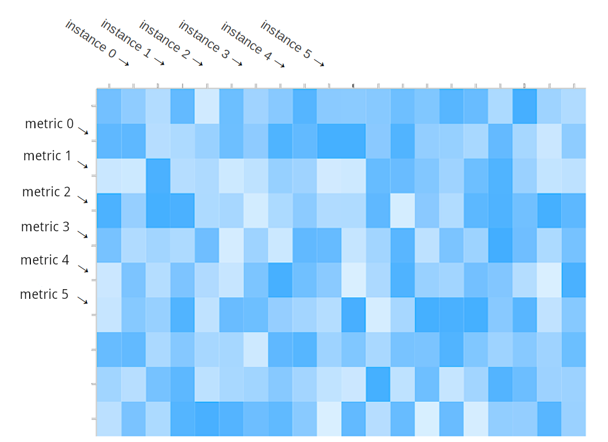

## Matrix

The ℳatriχ package provides the `matrix.Matrix` data-structure for storage, manipulation and transmission of both numeric and non-numeric (string) data. It is utilized by core components of Harvest, including collectors, plugins and exporters. It furthermore serves as an interface between these components, such that "the left hand does not know what the right hand does".

Internally, the Matrix is a collection of metrics (`matrix.Metric`) and instances (`matrix.Instance`) in the form of a 2-dimensional array:



Since we use hash tables for accessing the elements of the array, all metrics and instances added to the matrix must have a unique key. Metrics are typed and contain the numeric data (i.e. rows) of the Matrix. Instances only serve as pointers to the columents of the Matrix, but they also store non-numeric data as labels (`*dict.Dict`).

This package is the architectural backbone of Harvest, therefore understanding it is key for an advanced user or contributor.

# Basic Usage
## Initialize
```go
func matrix.New(name, object string, identifier string) *Matrix
// always returns successfully pointer to (empty) Matrix 
```
This section describes how to properly initialize a new Matrix instance. Note that if you write a collector, a Matrix instance is already properly initialized for you (as `MyCollector.matrix`), and if you write a plugin or exporter, it is passed to you from the collector. That means most of the time you don't have to worry about initializing the Matrix.

`matrix.New()` requires three arguments:
* `UUID` is by convention the collector name (e.g. `MyCollector`) if the Matrix comes from a collector, or the collector name and the plugin name concatenated with a `.` (e.g. `MyCollector.MyPlugin`) if the Matrix comes from a plugin.
* `object` is a description of the instances of the Matrix. For example, if we collect data about cars and our instances are cars, a good name would be `car`.
* `identifier` is a unique key used to identify a matrix instance

Note that `identifier` should uniquely identify a Matrix instance. This is not a strict requirement, but guarantees that your data is properly handled by exporters.

### Example
Here is an example from the point of view of a collector:

```go

import "github.com/netapp/harvest/v2/pkg/matrix"

var myMatrix *matrix.Matrix

myMatrix = matrix.New("CarCollector", "car", "car")
```

Next step is to add metrics and instances to our Matrix.

## Add instances and instance labels
```go
func (x *Matrix) NewInstance(key string) (*Instance, error)
// returns pointer to a new Instance, or nil with error (if key is not unique)
```

```go
func (i *Instance) SetLabel(key, value string)
// always successful, overwrites existing values
```
```go
func (i *Instance) GetLabel(key) string
// always returns value, if label is not set, returns empty string
```

Once we have initialized a Matrix, we can add instances and add labels to our instances.

### Example

```go

var (
    instance *matrix.Instance
    err error
)
if instance, err = myMatrix.NewInstance("SomeCarMark"); err != nil {
    return err
    // or handle err, but beware that instance is nil
}
instance.SetLabel("mark", "SomeCarMark")
instance.SetLabel("color", "red")
instance.SetLabel("style", "coupe")
// add as many labels as you like
instance.GetLabel("color") // return "red"
instance.GetLabel("owner") // returns ""
```

## Add Metrics
```go
func (x *Matrix) NewMetricInt64(key string) (*Metric, error)
// returns pointer to a new Metric of type int64, or nil with error (if key is not unique)
```

Metrics are typed and there are currently 4 types, all can be created with the same signature as above:
* `MetricUint8`
* `MetricUint64`
* `MetricInt64`
* `MetricFloat64`

We are able to read from and write to a metric instance using different types (as displayed in the next section), however choosing a type wisely ensures that this is done efficiently and overflow does not occur.

We can add labels to metrics just like instances. This is usually done when we deal with histograms:

```go
func (m Metric) SetLabel(key, value string)
// always successful, overwrites existing values
```
```go
func (m Metric) GetLabel(key) string
// always returns value, if label is not set, returns empty string
```

### Example

Continuing our Matrix for collecting car-related data:


```go
var (
    speed, length matrix.Metric
    err error
)

if speed, err = myMatrix.NewMetricUint64("max_speed"); err != nil {
    return err
}
if length, err = myMatrix.NewMetricFloat64("length_in_mm"); err != nil {
    return err
}
```

## Write numeric data

```go
func (x *Matrix) Reset()
// flush numeric data from previous poll
```
```go
func (m *Metric) SetValueInt64(i *Instance, v int64)
func (m *Metric) SetValueUint8(i *Instance, v uint8)
func (m *Metric) SetValueUint64(i *Instance, v uint64)
func (m *Metric) SetValueFloat64(i *Instance, v float64)
func (m *Metric) SetValueString(i *Instance, v string) error
// sets the value for the instance i to v
// SetValueString returns an error if v can not be converted to the metric's type;
// the numeric setters never return an error

```
```go
func (m *Metric) AddValueInt64(i *Instance, n int64)
// increments the numeric value for the instance i by n
// same signatures for all the types defined above
```

When possible you should reuse a Matrix for each data poll, but to do that, you need to call `Reset()` to drop old data from the Matrix. It is safe to add new instances and metrics after calling this method.

The `SetValue*()` and `AddValue*()` methods are typed same as the metrics. Even though you are not required to use the same type as the metric, it is the safest and most efficient way.

Since most collectors get their data as strings, it is recommended to use the `SetValueString()` method.

`SetValueString()` and `AddValueString()` return an error if value `v` can not be converted to the type of the metric; error is always `nil` when the type of `v` matches the type of the metric. The numeric `SetValue*()`/`AddValue*()` methods never return an error.

### Example

Continuing with the previous examples:


```go

if err = myMatrix.Reset(); err != nil {
    return
}
// write numbers to the matrix using the instance and the metrics we have created

// let the metric do the conversion for us
if err = speed.SetValueString(instance, "500"); err != nil {
    logger.Error(me.Prefix, "set speed value: ", err)
}
// here we ignore err since type is the metric type
length.SetValueFloat64(instance, 10000.00)

// safe to add new instances
var instance2 matrix.Instance
if instance2, err = myMatrix.NewInstance("SomeOtherCar"); err != nil {
    return err
}

// possible and safe even though speed has type Float32
length.SetValueInt64(instance2, 13000)

// possible, but will overflow since speed is unsigned
speed.SetValueInt64(instance2, -500)
```

## Read metrics and instances
In this section we switch gears and look at the Matrix from the point of view of plugins and exporters. Both those components need to read from the Matrix and have no knowledge of its origin or contents.

```go
func (x *Matrix) GetMetrics() map[string]Metric
// returns all metrics in the Matrix
```
```go
func (x *Matrix) GetInstances() map[string]*Instance
// returns all instances in the Matrix
```

Usually we will do a nested loop with these two methods to read all data in the Matrix. See examples below.

### Example: Iterate over instances

In this example the method `PrintKeys()` will iterate over a Matrix and print all metric and instance keys.

```go
func PrintKeys(x *matrix.Matrix) {
    for instanceKey, _ := range x.GetInstances() {
        fmt.Println("instance key=", instanceKey)
    }
}
```

### Example: Read instance labels

Each instance has a set of labels. We can iterate over these labels with the `GetLabel()` and `GetLabels()` method. In this example, we write a function that prints all labels of an instance:

```go
func PrintLabels(instance *matrix.Instance) {
    for label, value := range instance.GetLabels() {
        fmt.Printf("%s=%s\n", label, value)
    }
}
```

### Example: Read metric values labels

Similar to the `SetValue*` and `AddValue*` methods, you can choose a type when reading from a metric. If you don't know the type of the metric, it is safe to read it as a string. In this example, we write a function that prints the value of a metric for all instances in a Matrix:

```go
func PrintMetricValues(x *matrix.Matrix, m matrix.Metric) {
    for key, instance := range x.GetInstances() {
        if value, has := m.GetValueString(instance) {
            fmt.Printf("instance %s = %s\n", key, value)
        } else {
            fmt.Printf("instance %s has no value\n", key)
        }
    }
}
```