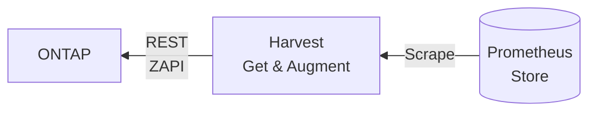

# Harvest Templates and Metrics

Harvest collects ONTAP counter information, augments it, and stores it in a time-series DB. Refer [ONTAP Metrics](../ontap-metrics.md) for details about ONTAP metrics exposed by Harvest. 



Three concepts work in unison to collect ONTAP metrics data,
prepare it and make it available to Prometheus.

- ZAPI/REST
- Harvest templates
- Exporters 

We're going to walk through an example from a running system, focusing on the `disk` object.

At a high-level, Harvest templates describe what ZAPIs to send to ONTAP and how to interpret the responses.

- ONTAP defines twos ZAPIs to collect `disk` info
    - Config information is collected via `storage-disk-get-iter`
    - Performance counters are collected via `disk:constituent`
- These ZAPIs are found in their corresponding object template file `conf/zapi/cdot/9.8.0/disk.yaml`
  and `conf/zapiperf/cdot/9.8.0/disk.yaml`. These files also describe how to map the ZAPI responses into a
  time-series-friendly format
- Prometheus uniquely identifies a time series by its metric name and optional key-value pairs called labels.

## Handy Tools

- [dasel](https://github.com/TomWright/dasel) is useful to convert between XML, YAML, JSON, etc. We'll use it to make
  displaying some of the data easier.

## ONTAP ZAPI disk example

We'll use the `bin/zapi` tool to interrogate the cluster and gather information about the counters. This is one way you
can send ZAPIs to ONTAP and explore the return types and values.

```
bin/zapi -p u2 show attrs --api storage-disk-get-iter
```

> Output edited for brevity and line numbers added on left

The hierarchy and return type of each counter is shown below. We'll use this hierarchy to build a matching Harvest
template.
For example, line `3` is the `bytes-per-sector` counter, which has an integer value, and is the child
of `storage-disk-info > disk-inventory-info`.

To capture that counter's value as a metric in a Harvest, the ZAPI template must use the same hierarchical path. The
matching path can be seen [below](#harvest-object-template).

```
building tree for attribute [attributes-list] => [storage-disk-info]

 1 [storage-disk-info]            -               *
 2   [disk-inventory-info]        -                
 3     [bytes-per-sector]         -         integer
 4     [capacity-sectors]         -         integer
 5     [disk-type]                -          string
 6     [is-shared]                -         boolean
 7     [model]                    -          string
 8     [serial-number]            -          string
 9     [shelf]                    -          string
10     [shelf-bay]                -          string
11   [disk-name]                  -          string
12   [disk-ownership-info]        -                
13     [home-node-name]           -          string
14     [is-failed]                -         boolean
15     [owner-node-name]          -          string
16   [disk-raid-info]             -                
17     [container-type]           -          string
18     [disk-outage-info]         -                
19       [is-in-fdr]              -         boolean
20       [reason]                 -          string  
21   [disk-stats-info]            -                
22     [average-latency]          -         integer
23     [disk-io-kbps]             -         integer
24     [power-on-time-interval]   -         integer
25     [sectors-read]             -         integer
26     [sectors-written]          -         integer
27   [disk-uid]                   -          string
28   [node-name]                  -          string
29   [storage-disk-state]         -         integer
30   [storage-disk-state-flags]   -         integer
```

## Harvest Templates

To understand templates, there are a few concepts to cover:

There are three kinds of information included in templates that define what Harvest collects and exports:

1. Configuration information is exported into the `_labels` metric (e.g. `disk_labels` see below)
2. Metrics data is exported as `disk_"metric name"` e.g. `disk_bytes_per_sector`, `disk_sectors`, etc. Metrics are leaf
   nodes that are not prefixed with a ^ or ^^. Metrics must be one of the number types: float or int.
3. Plugins may add additional metrics, increasing the number of metrics exported in #2

A resource will typically have multiple instances. Using disk as an example, that means there will be one `disk_labels`
and a metric row per instance. If we have 24 disks and the disk template lists seven metrics to capture, Harvest will
export a total of 192 rows of Prometheus data.

`24 instances * (7 metrics per instance + 1 label per instance) = 192 rows`

Sum of disk metrics that Harvest exports

```
curl -s 'http://localhost:14002/metrics' | grep ^disk | cut -d'{' -f1 | sort | uniq -c
  24 disk_bytes_per_sector
  24 disk_labels
  24 disk_sectors
  24 disk_stats_average_latency
  24 disk_stats_io_kbps
  24 disk_stats_sectors_read
  24 disk_stats_sectors_written
  24 disk_uptime
# 192 rows 
```

Read on to see how we control which labels from #1 and which metrics from #2 are included in the exported data.

### Instance Keys and Labels

- Instance key - An instance key defines the set of attributes Harvest uses to construct a key that uniquely identifies
  an object. For example, the disk template uses the `node` + `disk` attributes to determine uniqueness. Using `node`
  or `disk` alone wouldn't be sufficient since disks on separate nodes can have the same name. If a single label does
  not uniquely identify an instance, combine multiple keys for uniqueness. Instance keys must refer to attributes that
  are of type `string`.

  Because instance keys define uniqueness, these keys are also added to each metric as a key-value pair. (
  see [Control What Labels and Metrics are Exported](#control-what-labels-and-metrics-are-exported) for examples)

- Instance label - Labels are key-value pairs used to gather configuration information about each instance. All of the
  key-value pairs are combined into a single metric named `disk_labels`. There will be one `disk_labels` for each
  monitored instance. Here's an example reformatted so it's easier to read:

```
disk_labels{
  datacenter="dc-1",
  cluster="umeng-aff300-05-06",
  node="umeng-aff300-06",
  disk="1.1.23",
  type="SSD",
  model="X371_S1643960ATE",
  outage="",
  owner_node="umeng-aff300-06",
  shared="true",
  shelf="1",
  shelf_bay="23",
  serial_number="S3SENE0K500532",
  failed="false",
  container_type="shared"
}
```

### Harvest Object Template

Continuing with the disk example, below is the `conf/zapi/cdot/9.8.0/disk.yaml` that tells Harvest which ZAPI to send to
ONTAP (`storage-disk-get-iter`) and describes how to interpret and export the response.

- Line `1` defines the name of this resource and is an exact match to the object defined in your `default.yaml`
  or `custom.yaml` file. Eg.

```
# default.yaml
objects:
  Disk:  disk.yaml
```

- Line `2` is the name of the ZAPI that Harvest will send to collect disk resources
- Line `3` is the prefix used to export metrics associated with this object. i.e. all metrics will be of the
  form `disk_*`
- Line `5` the [counter section](https://github.com/NetApp/harvest/tree/main/conf#counters) is where we define the
  metrics, labels, and what constitutes instance uniqueness
- Line `7` the double hat prefix `^^` means this attribute is an instance key used to determine uniqueness. Instance
  keys are also included as labels. Uuids are good choices for uniqueness
- Line `13` the single hat prefix `^` means this attribute should be stored as a label. That means we can include it in
  the `export_options` section as one of the key-value pairs in `disk_labels`
- Rows 10, 11, 23, 24, 25, 26, 27 - these are the metrics rows - metrics are leaf nodes that are not prefixed with a ^
  or ^^. If you refer back to the [ONTAP ZAPI disk example](#ontap-zapi-disk-example) above, you'll notice each of these
  attributes are integer types.
- Line 43 defines the set of labels to use when constructing the `disk_labels` metrics. As
  mentioned [above](#instance-keys-and-labels), these labels capture config-related attributes per instance.

> Output edited for brevity and line numbers added for reference.

```
 1	name:             Disk
 2	query:            storage-disk-get-iter
 3	object:           disk
 4	
 5	counters:
 6	  storage-disk-info:
 7	    - ^^disk-uid
 8	    - ^^disk-name               => disk
 9	    - disk-inventory-info:
10	      - bytes-per-sector        => bytes_per_sector        # notice this has the same hierarchical path we saw from bin/zapi
11	      - capacity-sectors        => sectors
12	      - ^disk-type              => type
13	      - ^is-shared              => shared
14	      - ^model                  => model
15	      - ^serial-number          => serial_number
16	      - ^shelf                  => shelf
17	      - ^shelf-bay              => shelf_bay
18	    - disk-ownership-info:
19	      - ^home-node-name         => node
20	      - ^owner-node-name        => owner_node
21	      - ^is-failed              => failed
22	    - disk-stats-info:
23	      - average-latency
24	      - disk-io-kbps
25	      - power-on-time-interval  => uptime
26	      - sectors-read
27	      - sectors-written
28	    - disk-raid-info:
29	      - ^container-type         => container_type
30	      - disk-outage-info:
31	        - ^reason               => outage
32	
33	plugins:
34	  - LabelAgent:
35	    # metric label zapi_value rest_value `default_value`
36	    value_to_num:
37	      - new_status outage - - `0` #ok_value is empty value, '-' would be converted to blank while processing.
38	
39	export_options:
40	  instance_keys:
41	    - node
42	    - disk
43	  instance_labels:
44	    - type
45	    - model
46	    - outage
47	    - owner_node
48	    - shared
49	    - shelf
50	    - shelf_bay
51	    - serial_number
52	    - failed
53	    - container_type
```

### Control What Labels and Metrics are Exported

Let's continue with `disk` and look at a few examples. We'll use `curl` to examine the Prometheus wire format that
Harvest uses to export the metrics from `conf/zapi/cdot/9.8.0/disk.yaml`.

The curl below shows all exported disk metrics. There are 24 disks on this cluster, Harvest is collecting seven
metrics + one disk_labels + one plugin-created metric, `disk_new_status` for a total of 216 rows.

```
curl -s 'http://localhost:14002/metrics' | grep ^disk | cut -d'{' -f1 | sort | uniq -c
  24 disk_bytes_per_sector           # metric
  24 disk_labels                     # labels 
  24 disk_new_status                 # plugin created metric 
  24 disk_sectors                    # metric 
  24 disk_stats_average_latency      # metric   
  24 disk_stats_io_kbps              # metric 
  24 disk_stats_sectors_read         # metric   
  24 disk_stats_sectors_written      # metric  
  24 disk_uptime                     # metric
# sum = ((7 + 1 + 1) * 24 = 216 rows)
```

Here's a `disk_labels` for one instance, reformated to make it easier to read.

```
curl -s 'http://localhost:14002/metrics' | grep ^disk_labels | head -1

disk_labels{
  datacenter = "dc-1",                 # always included - value taken from datacenter in harvest.yml
  cluster = "umeng-aff300-05-06",      # always included
  node = "umeng-aff300-06",            # node is in the list of export_options instance_keys
  disk = "1.1.13",                     # disk is in the list of export_options instance_keys
  type = "SSD",                        # remainder are included because they are listed in the template's instance_labels
  model = "X371_S1643960ATE",
  outage = "",
  owner_node = "umeng-aff300-06",
  shared = "true",
  shelf = "1",
  shelf_bay = "13",
  serial_number = "S3SENE0K500572",
  failed = "false",
  container_type = "",
} 1.0
```

Here's the `disk_sectors` metric for a single instance.

```
curl -s 'http://localhost:14002/metrics' | grep ^disk_sectors | head -1

disk_sectors{                          # prefix of disk_ + metric name (line 11 in template)
  datacenter = "dc-1",                 # always included - value taken from datacenter in harvest.yml
  cluster = "umeng-aff300-05-06",      # always included
  node = "umeng-aff300-06",            # node is in the list of export_options instance_keys
  disk = "1.1.17",                     # disk is in the list of export_options instance_keys
} 1875385008                           # metric value - number of sectors for this disk instance
```

```
Number of rows for each template = number of instances * (number of metrics + 1 (for <name>_labels row) + plugin additions)
Number of metrics                = number of counters which are not labels or keys, those without a ^ or ^^
```

## Common Errors and Troubleshooting

### 1. Failed to parse any metrics

You add a new template to Harvest, restart your poller, and get an error message:

```
WRN ./poller.go:649 > init collector-object (Zapi:NetPort): no metrics => failed to parse any
```

This means the collector, `Zapi NetPort`, was unable to find any metrics. [Recall metrics](#harvest-templates) are lines
without prefixes. In cases where you don't have any metrics, but still want to collect labels, add
the `collect_only_labels: true` key-value to your template. This flag tells Harvest to ignore that you don't have
metrics and
continue. [Example](https://github.com/NetApp/harvest/blob/7334f11419075bf98b45fd14aee41dc2c16e4531/conf/zapi/cdot/9.8.0/qtree.yaml#L17).

### 2. Missing Data

1. What happens if an attribute is listed in the list of `instance_labels` (line 43 above), but that label is missing
   from the list of counters captured at line 5?

The label will still be written into `disk_labels`, but the value will be empty since it's missing. e.g if line 29 was
deleted `container_type` would still be present in `disk_labels{container_type=""}`.

## Prometheus Wire Format

https://prometheus.io/docs/instrumenting/exposition_formats/

Keep in mind that Prometheus does not permit dashes (`-`) in labels. That's why Harvest templates use name replacement
to convert dashed-names to underscored-names with `=>`. e.g. `bytes-per-sector => bytes_per_sector`
converts `bytes-per-sector` into the Prometheus accepted `bytes_per_sector`.

Every time series is uniquely identified by its metric name and optional key-value pairs called labels.

Labels enable Prometheus's dimensional data model: any combination of labels for the same metric name identifies a
particular dimensional instantiation of that metric (for example: all HTTP requests that used the method POST to the
/api/tracks handler). The query language allows filtering and aggregation based on these dimensions. Changing any label
value, including adding or removing a label, will create a new time series.

> `<metric_name>{<label_name>=<label_value>, ...} value [ timestamp ]`
>
> - metric_name and label_name carry the usual Prometheus expression language restrictions
> - label_value can be any sequence of UTF-8 characters, but the backslash (\), double-quote ("), and line feed (\n)
    characters have to be escaped as \\, \", and \n, respectively.
> - value is a float represented as required by Go's ParseFloat() function. In addition to standard numerical values,
    NaN, +Inf, and -Inf are valid values representing not a number, positive infinity, and negative infinity,
    respectively.
> - timestamp is an int64 (milliseconds since epoch, i.e. 1970-01-01 00:00:00 UTC, excluding leap seconds), represented
    as required by Go's ParseInt() function
>
> [Exposition formats](https://prometheus.io/docs/instrumenting/exposition_formats/#comments-help-text-and-type-information) 
