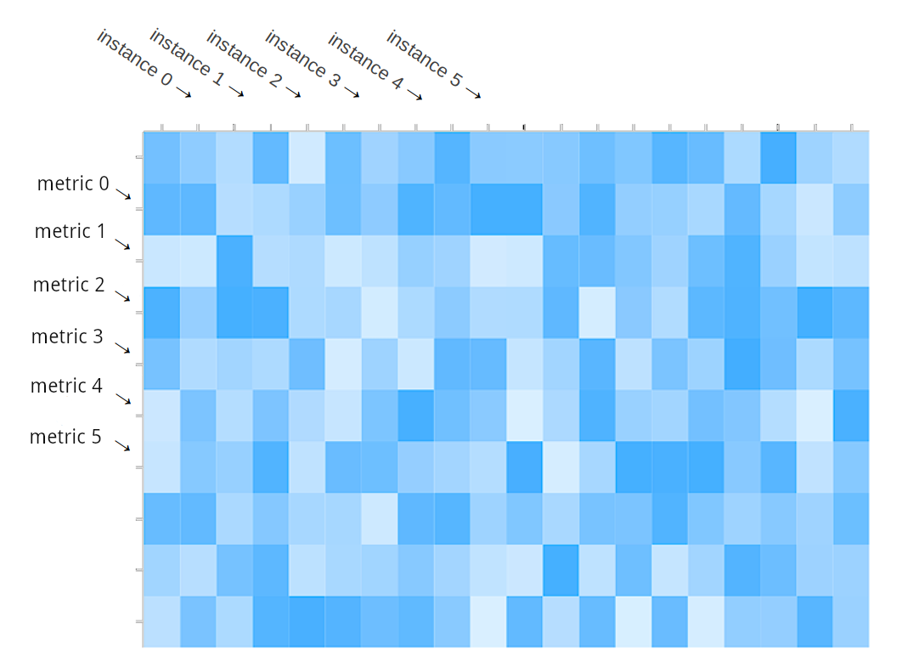

# ℳatriχ


The `matrix` package provides the `matrix.Matrix` data-structure for storage, manipulation and transmission of both numeric and non-numeric (string) data. It is utilized by core components of Harvest, including collectors, plugins and exporters. It furthermore serves as an interface between these components, such that "the left hand does not know what the right hand does".

Internally, the Matrix is a collection of metrics (`matrix.Metric`) and instances (`matrix.Instance`) in the form of a 2-dimensional array:

<center></center><br />

Since we use hash tables for accessing the elemnts of the array, any metrics and instances added two the Matrix should have a unique key. Metrics are typed and contain the numeric data (i.e. rows) of the Matrix. Instances only serve as pointers to the columents of the Matrix, but they also store non-numeric data as labels (`*dict.Dict`).

This package is the architectural backbone of Harvest, therefore understanding it is key for an advanced user or contributor.


# Basic Usage
## Initialize
```go
func matrix.New(name, object string) *Matrix
// always returns successfully pointer to (empty) Matrix 
```
This section describes how to properly initialize a new Matrix instance. Note that if you write a collector, a Matrix instance is already properly initialized for you (as `MyCollector.matrix`), and if you write a plugin or exporter, it is passed to you from the collector. So most of the time you should not worry about properly initializing the Matrix. 

`matrix.New()` requires two arguments:
* `name` is by convention the collector name (e.g. `MyCollector`), if the Matrix comes from a collector, or the collector name and the plugin name concatenated with a `.` (e.g. `MyCollector.MyPlugin`), if the Matrix comes from a plugin.
* `object` is the best desciption of the instances of the Matrix. For example `car` if we collect data about cars and our instances are cars.
  
Note that the combination of `name` and `object` should uniquely identify a Matrix instance. This is not a strict requirement, but guarantes that our data is properly handled by exporters.

### Example
Here is an example from the point of view of a collector:

```go

import "goharvest2/share/matrix"

var myMatrix *matrix.Matrix

myMatrix = matrix.New("CarCollector", "car")
```

Next step is to add metrics and instances to our Matrix.

## Add instances and instance labels
```go
func (x *Matrix) NewInstance(key string) (*Instance, error)
// returns pointer to a new Instance, or nil with error (if key is not unique)
```

```go
func (i *Instance) SetLabel(key, value string)
// always successfull, overwrite possibly pre-existing values
```
```go
func (i *Instance) GetLabel(key) string
// always returns value, if label is not set, returns empty string
```

Once we have initialized a Matrix, we can add instances and add labels to our instances.

### Example

```go

var (
    instance *matrix.Instance
    err error
)
if instance, err = myMatrix.NewInstance("SomeCarMark"); err != nil {
    return err
    // or handle err, but beware that instance is nil
}
instance.SetLabel("mark", "SomeCarMark")
instance.SetLabel("color", "red")
instance.SetLabel("style", "coupé")
// add as many labels as you like
instance.GetLabel("color") // return "red"
instance.GetLabel("owner") // returns ""
```

## Add Metrics
```go
func (x *Matrix) NewMetricInt(key string) (Metric, error)
// returns pointer to a new MetricInt, or nil with error (if key is not unique)
// note that Metric is an interface
```

Metrics are typed and there are currently 8 types, all can be created with the same signature as above:
* `MetricUint8`
* `MetricUint32`
* `MetricUint64`
* `MetricInt`
* `MetricInt32`
* `MetricInt64`
* `MetricFloat32`
* `MetricFloat64`
We are able to read from and write to a metric instance using different types (as displayed in the next section), however choosing a type wisely ensures that this is done efficiently and overflow does not occur.

Furthermore we can add labels to metrics just the same way as we did with instances. This is usually done when we deal with histograms:

```go
func (m Metric) SetLabel(key, value string)
// always successfull, overwrites old value if it exists
```
```go
func (m Metric) GetLabel(key) string
// always returns value, if label is not set, returns empty string
```

### Example

Continuing our Matrix for collecting car-related data:


```go
var (
    speed, length matrix.Metric
    err error
)

if speed, err = myMatrix.NewMetricUint32("max_speed"); err != nil {
    return err
}
if length, err = myMatrix.NewMetricFloat32("length_in_mm"); err != nil {
    return err
}
```

## Write numeric data

```go
func (x *Matrix) Reset()
// flush numeric data from previous poll
```
```go
func (m Metric) SetValueInt(i *Instance, v int) error
func (m Metric) SetValueInt32(i *Instance, v int32) error
func (m Metric) SetValueInt64(i *Instance, v int64) error
func (m Metric) SetValueUint8(i *Instance, v uint8) error
func (m Metric) SetValueUint32(i *Instance, v uint32) error
func (m Metric) SetValueUint64(i *Instance, v uint64) error
func (m Metric) SetValueFloat32(i *Instance, v float32) error
func (m Metric) SetValueFloat64(i *Instance, v float64) error
func (m Metric) SetValueBytes(i *Instance, v []byte) error
func (m Metric) SetValueString(i *Instance, v []string) error
// sets the numeric value for the instance i to v
// returns error if v is invalid (explained below)

```
```go
func (m Metric) AddValueInt(i *Instance, v int) error
// increments the numeric value for the instance i by v
// same signatures for all the types defined aboce
```

If we re-used a Matrix for each data poll (recommended), we should call call `Reset()` to flush old data Note that it is still safe to add new instances and metrics after calling this method.

The `SetValue*()` and `AddValue*()` methods are typed as the metrics themselves. However we are not required to use same type as the type of our metric although that is the safest and most efficient way.

Since most collectors get their data as bytes or strings, it is recommended to use the `SetValueString()` and `SetValueBytes()` methods.

These methods return an error if value `v` can not be converted to the type of the metric. Error is always `nil` is type of `v` matches the type of the metric.


### Example

We assume here the variables defined in the previous examples:


```go

if err = myMatrix.Reset(); err != nil {
    return
}
// write numbers to the matrix using the instance and the metrics we have created

// let the metric to the conversion for us
if err = speed.SetValueString(instance, "500"); err != nil {
    logger.Error(me.Prefix, "set speed value: ", err) // for usage of the logger module see its documentation
}
// here we ignore err since type is the metric type
length.SetValueFloat32(instance, 10000.00)

// safe to add new instances
var instance2 matrix.Instance
if instance2, err = myMatrix.NewInstance("SomeOtherCar"); err != nil {
    return err
}

// possible and safe even though speed has type Float32
} if err = length.SetValueInt32(instance2, 13000); err != nil {
    logger.Error(me.Prefix, "set speed value:", err)
}

// possible, but will overflow since speed is unsigned
} if err = speed.SetValueInt32(instance2, -500); err != nil {
    logger.Error(me.Prefix, "set length value:", err)
}
```

## Retrieve metrics and instances
In the next sections we switch gears and look at the Matrix from the POV of plugins and exporters, who have to read from the Matrix and have no knowledge if its origin and contents. 

```go
func (x *Matrix) GetMetrics(key string) map[string]Metric
// returns all metrics in the Matrix
```
```go
func (x *Matrix) GeInstances(key string) map[string]*Instance
// returns all instances in the Matrix
```

Usually we will do two loops with these two methods to read all data in the Matrix. See example in next section.

### Example

In this example the method `PrintKeys()` will iterate of a Matrix and print all metric and instance keys.

```go

func PrintKeys(x *matrix.Matrix) {
    for ik, _ := range x.GetInstances() {
        fmt.Println("instance key=", ik)
    }
}
```

`get_instances()` and `get_counters()` return iterables of Instance and Counter objects. Each of these objects has the methods and attributes described above (e.g. `instance.get_all()` gives us all instance labels).

### 2.2. Retrieving values
Before using a counter value it's usually a good idea to check if the counter is enabled (`counter.enabled`) and if it's actually a number (`value == value` is `False` for NaNs).

Anything else is up to the Exporter

### 2.3. Slightly better way
The above script will run much faster when using list comprehension:

```python
def export(data):
    ins = list(data.get_instances())
    with open(filename, 'w') as fd:
        fd.write('counter' + ',')
        fd.write(','.join(i.name for i in ins + ['\n']))
        for c in data.get_counters():
            if c.enabled:
                fd.write(c.name+',')
                fd.write(','.join(data.get_filtered(c,i,default='') for i in ins))
                fd.write('\n')
```
`get_filtered` returns value or `default` if value is `NaN`.